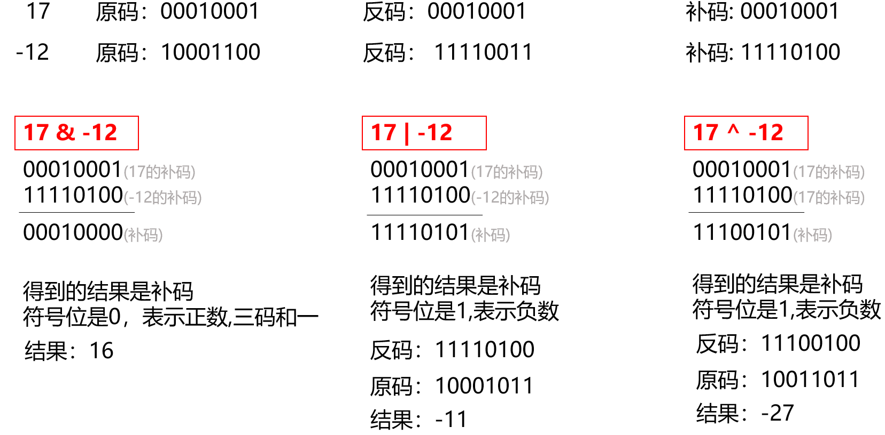

# 一、基本知识

## 1 基本且重要的知识

### 1.1 bit、byte、KB、B、字节、位详解

* bit(b):位/比特位,计算机表示**数据**的最小单位
* byte(B):字节,计算机中最基本的**存储单元**(内存单元)
* bytes:多个字节

### 1.2 字节(Byte)、半字(Half-word)、字(word)

#### (1) 基础了解

* 字大小取决于系统总线宽度：
  * 32位系统:一个字 = 4字节(byte);
  * 64位系统:一个字 = 8字节(byte)。
* 无论操作系统的位宽是多少,1byte=8bite,半字为字的一半,双字(double word)为字(word)的2倍永远不变
* 一个ASCII字母占用1byte
* 一个汉字占用2byte(GBK中)
* Intel公司中用术语：
  * 字(word)表示16位数据类型
  * 双字(double word)表示32位数据类型
  * 四字(quad word) 表示64位数据类型。
* Intel公司中无论是32位架构的机器还是64位架构的机器,它们都是从16位架构的基础上扩展的

#### (2) ARM系统中

* 字节(byte):字节长度为8位
* 半字(Half-Word):半字的长度为16位,2个字节
* 字(word):字的长度为32位,4字节

### 1.3 波特率和频率的关系★

* 波特率：定义一个时间段内发送的数据位数,单位：比特/秒(bps)
* 频  率：是指一个时间段内发送的信号个数,单位：赫兹(Hz)

#### (1)实例

100kHz的 SPI频率 和无线 波特率 为2Mbps是否合适问题
SPI的频率为100kHz：是指SCK每秒的脉冲数,也就是比特率。

* 每个脉冲要的时间是1/频率=1/100 000=1/0.1μs=10μs
* 1bit  需要时间：10μs
* 1byte 需要时间：8*10μs=80μs
* 32byte需要时间：80*32=2560μs=2.56ms
* 2Mbps:2000 000bits/s
* 时间： 1/2000 000=0.5μs
* 4字节 = 32 * 0.5 = 16μs
* 32字节纯负载：32 * 8 * 0.5 = 128 μs

  * 因为无线传输等需要加上包头/CRC 等空口开销
  * 不同芯片不同，粗略算个 20–120 µs
  * (128+20 - 128+120)=(148 - 228) 整包上空大概 0.15–0.25 ms 量级。
* 无线 2Mbps发完32B只需要 ~0.2ms ,而SPI 读/写 32B需要 2.56ms

  * 发射：往无线FIFO写32B需要 2.56ms ,但无线发送只用~0.2ms发送完
  * 接收：每0.2ms就可能来一个32B的包，你读32B需要2.56ms 。FIFO会很快被填满导致丢包(接收来不及的根本原因)

*直白点：在连续高包率下，SPI=100 kHz 无法支撑 2 Mbps 的空口速率——瓶颈在 SPI。

* 1b:1/200 0000=5×10^-7 s ==> 每个比特需要0.5μs

### 1.4 进制转换与各类型的大小

#### (1).进制转换

##### a.字节转换

* 1byte(1B) = 8bit(8b) <====> 1B=8b
* 1KB = 1024B
* 4KB = 2的12次方byte,0x1000,表示的地址范围0x000~0xFFF。
* 1MB = 1024KB = 2的20次方byte===地址范围0x00000~0xFFFFF

---

##### b.时间转换

* 1 ms = 1000 μs
* 1 μs = 1000 ns

---

##### c.一般的转换

* 1M =10^6=100 0000

#### (2)进制转换英文代表

* BIN : binary,二进制
* OCT : octal,八进制
* HEX : hexadecimal,十六进制
* DEC : decimal,十进制

#### (3)存储类型各为多少

| 类型                       | 字节                        |
| -------------------------- | --------------------------- |
| char/unsigned char/uint8_t | 1字节                       |
| char*                      | 4和8字节(32位4*8,64位8*8) |
| short/short int/uint16_t   | 2字节                       |
| int / unsigned int         | 4字节                       |
| float                      | 4字节                       |
| double                     | 8字节                       |
| long                       | 4字节(32位)-8字节(64位)     |
| long long                  | 8字节                       |
| usigned long               | 4字节                       |
| boolead                    | 1字节                       |

---

### 1.5 大端小端

#### 1.5.0 前置知识

* STM32默认小端模式
* 在单机运行时，程序员不必关心大小端；
* 但在不同 CPU 通信时，字节序不一致就会导致 数据解释错误。

#### 1.5.1 定义

* 大端：高字节存放在低地址
* 小端：高字节存放在高地址

```c
int a = 0x12345678;  // 32位整数，占4字节
/**小端存储 */
地址    数据
0x1000  0x78   (最低字节)
0x1001  0x56
0x1002  0x34
0x1003  0x12   (最高字节)
```

### 1.6 对齐模式

#### 1.6.0 前置知识

* CPU访问内存时，通常是以**字长(word)**为单位读取
  * 32位：一次性4字节
  * 64位：一次性8字节

#### 1.6.1 原理

* 如果数据对齐：CPU一次性能读出
* 如果数据不对齐：麻烦

```c
/**对齐存放 */
地址: 0x2000 0000  0x2000 0001  0x2000 0002  0x2000 0003
数据:  [  0x12 ]    [  0x34 ]    [  0x56 ]     [ 0x78 ]
int x存放在0x2000 0000 - 0x2000 0003
CPU只需读取一次4字节访问即可取出0x78563412
/**非对其存放 */
地址: 0x2000 0001  0x2000 0002  0x2000 0003  0x2000 0004  0x2000 0005
数据:  [  0xAA ]    [  0x12 ]    [  0x34 ]     [ 0x56 ]     [ 0x78 ]

int x占用0x2000 0001 - 0x2000 0004
读取：
  先读：0x2000 0000 - 0x2000 0003
  再读：0x2000 0004 - 0x2000 00007
再拼接：

```

* 如4字节的 int数据放在地址 0x2000 0001
  * 需要访问0x2000 0000 和 0x2000 0010
  * 再拼接0x2000 0001 + 0x2000 0010
  * 有的框架甚至会触发**总线错误**
    👉对齐模式 本质上是：让数据的起始地址满足一定的规则（通常是其大小的整数倍），以便 CPU 高效、正确地访问。

#### 1.6.2 结构对其

##### (1)结构体对齐

```c
struct A 
{
    char  c;   // 1 字节
    int   i;   // 4 字节
};
地址:   
  c    pad  pad  pad   
  i0    i1  i2   i3
大小:   共 8 字节，而不是 5

c 占 1 字节，地址对齐没问题。
i 必须 4 字节对齐，所以编译器会在 c 后面自动填充 3 个字节。
```

* 默认会在结构体中插入填充字节（padding），保证成员按照最大对齐规则存放。

## 2.运算符

### 2.1 算术运算符

#### 2.1.1"/"和"%"

##### (1) "/"

* "/":两个均为整数,则结果为整数,舍去小数
* 有一个为小数,结果为两个小数的小数。
* 例如：
  * 5/2 = 2
  * 5.0/2=2.5

##### (2) "%"

* "%":取余,只能用于整数运算，返回的是除法运算的余数。

---

#### 2.1.2"++"和"--"

* 前置形式 (++i)：先使变量自增，再参与运算。
  * 例：int i = 5; int a = ++i; → i = 6; a = 6。
* 后置形式 (i++)：先参与运算，再自增。
  * 例：int i = 5; int a = i++; → i = 6; a = 5。

---

### 2.2 逻辑运算符"!"、"||"、"&&"

#### 2.2.1 "!" 逻辑非

* 规则：将逻辑值取反

##### 2.2.2 "&&" 逻辑与

* 规则：两个操作数都为真(非零),那么表达式的值为真,否则为假。
  * 例：(5 > 2) && (3 < 4) → 1 && 1 = 1
* 短路现象：如果第一个操作数为假,第二个操作数没有计算的必要了
  * 例：(0 && (5/0)) → 第一个操作数为 0，第二个不会计算(避免除零错误)

##### 2.2.3 "||" 逻辑或

* 规则：只要有一个操作数为真,表达式的值就为真；两个操作数都为假,表达式的值为假。
  * 例：(5 > 2) || (3 > 5) → 1 || 0 = 1
* 短路现象：第一个操作数为真,第二个操作数不再计算。
  * 例：(1 || (5/0)) → 第一个操作数为真，后面不会执行(避免错误

---

### 2.3 位运算符"&"、"|"、"^"、"~"、"<<"、">>"

--"与"、"或"、"异或"、"按位取反"、"按位左移"、"按位右移"

#### 2.3.0 前置知识

* 操作数进行位运算的时候,以它的补码形式进行运算。

#### 2.3.1 "&"、"|"、"^" —— 与、或、异或

##### (1) "&" (按位与)

* 规则：逐位比较，两个二进制位都为1 -> 结果为1，否则为0
* 例：6 & 3 → 110 & 011 = 010 = 2

##### (2) "|"(按位或)

* 规则：逐位比较，有一个为1 -> 结果为1
* 例：6 | 3 → 110 | 011 = 111 = 7

##### (3) "^"(按位异或)

* 逐位比较，相同为 0，不同为 1。
* 例：6 ^ 3 → 110 ^ 011 = 101 = 5。


##### (4)"~" (按位取反) ~17和~-12

* 规则：原理：把补码中的 0 和 1 逐位取反。
* 例：~17

```c
17 的二进制：0001 0001
取反：1110 1110
补码 1110 1110 对应的原码是 -18。
所以 ~17 = -18。
```

* 例~-12

```c
-12 的补码：1111 0100
取反：0000 1011
这是 +11。
所以 ~-12 = 11。
```


#### 2.3.2 "<<"和">>" —— 按位左移、右移

##### (1) <<

* 把二进制整体向左移动 n 位，右边补 0。
* 相当于：x << n = x * 2ⁿ(不考虑溢出)。
* 例：3 << 2 = 12(0011 → 1100)。
* 对 有符号数，如果左移后符号位发生变化，就会出现溢出，结果未定义。

👉 推荐做法：

* 用 unsigned 类型做移位运算（尤其是底层寄存器操作）。
* 避免对有符号类型做大位移

##### (2) >>

* 算术右移(大多数 C 编译器)：左边补符号位(正数补 0，**负数补 1**)。
  * 相当于：x >> n = x / 2ⁿ(向下取整)。
  * 例：-8 >> 2 = -2。
* 逻辑右移(少数情况，如无符号数)：左边补 0。
  

### 2.4 三元运算符

* 条件表达式? 表达式1: 表达式2；
* 可嵌套使用
* 三元运算符是一个表达式，不是语句，所以能直接参与赋值。
  * 例如：int res = (x > 0) ? x : -x;

### 2.5 总结

* 总体上：一元运算符 > 算术运算符 > 关系运算符 > 逻辑运算符 > 三元运算符 > 赋值运算符。

#### (1) 从高到低的大致顺序(部分)：

* 一元运算符：!、~、++、--、类型转换 (type)
* 算术运算符：*、/、%、+、-
* 关系运算符：>、<、>=、<=、==、!=
* 按位运算：&、|
* 逻辑运算符：&&、||
* 三元运算符：?:
* 赋值运算符：=、+=、-=、*=、/= 等

#### (2)记忆小技巧：

* 越贴近操作数的，优先级越高(如一元运算符)。
* 越“宏观逻辑控制”的，优先级越低(如赋值)。
* 如果拿不准 → 加括号 明确优先级，保证程序可读性。

### 2.6 拓展

#### 2.6.1 逻辑运算符"|"和"||"

##### (1) "||"

* "||"逻辑或运算符:用于布尔表达式,至少一个表达式为真时返回真(有短路);
* 如果左侧表达式为真,右侧表达式将不会被计算。

##### (2) "|"

* "|"位或运算符:操作数的二进制位的逐位处理，(无短路)
* 无论左侧表达式的值如何,右侧表达式都会被计算。

## 3.原码/反码/补码的使用

### 3.1基本知识点

* 计算机内部运算一般是以补码形式进行的
* 1 个字节（8 bit）的有符号二进制只能表示+/-128,超过范围就会发生溢出,符号改变
* 对于 n 位二进制(假设 n=8)：
  * 表示范围是：-2^(n-1) ~ 2^(n-1)-1
  * 8 位：-128 ~ +127
* 溢出：超过表示范围，符号和数值会“翻转”。

### 3.2原码 / 反码 / 补码

#### 3.2.1 原码

* 规则：最高位表示符号,其余位表示绝对值大小

 十进制        原码

* +5：      0000 0101
* -5：      1000 0101
* +0：      0000 0000
* -0：      1000 0000
* 优点：直观, 符号和数值位明确
* 缺点：

  * 出现+0和-0两种表示,造成浪费；
  * 加减法硬件实现复杂(尤其是减法)

#### 3.2.2 反码

* 规则：是负数的符号位不变,其余位按位取反
  * 正数：反码=原码
  * 负数：原码符号位不变,其余位取反

 十进制        原码             反码

* +5       0000 0101       0000 0101
* -5       1000 0101       1111 1010
* +0       0000 0000       0000 0000
* -0       1000 0000       1111 1111
* 优点：负数比原码方便一些,减法可转换为加法处理
* 缺点：

  * +0和-0有两种表达；
  * 硬件实现加法还需加一个 末位进位

#### 3.2.3 补码

* 规则：补码是计算机广泛使用的表示负数的方法。
  * 正数：补码 = 原码
  * 负数：补码 = 反码 + 1(即符号位不变,其余位按位取反再加1)。

 十进制     原码        反码        补码

* +5    0000 0101   0000 0101   0000 0101
* -5    1000 0101   1111 1010   1111 1011
* +0    0000 0000   0000 0000   0000 0000
* -0    1000 0000   1111 1111   0000 0000
* 优点：

  * 只有一个0(消除了 +0/-0);
  * 加减法可以统一为二进制加法运算:(A-B = A + (-B))
  * 硬件实现简单

#### 3.2.4 实例5 + (-3)

+5的补码：0000 0101
-3的补码：1000 0011     1111 1100   1111 1101
+5+(-3)：
0000 0101+1111 1101
    +
1111 1101
补码=
0000 0010
实际=
0000 0010=2

#### 3.2.5 补码的作用

* (1)**统一加减法运算**：在补码系统下,加法器即可处理加法,也可以处理减法
* (2)**消除零的二义性**：
  * 原码和反码：存在 +0 和 -0 两种表示
  * 补码：只有唯一的 0000 0000
    * +0(0000...0)
    * -0(1000...0 或 1111...1)
* (3)**便于溢出判断**：同号相加才可能溢出；异号相加不会溢出。
  * 正 + 正 → 出现负数 ⇒ 溢出
  * 负 + 负 → 出现正数 ⇒ 溢出

```c
同号相加 → 可能溢出
    正 + 正 → 结果变成负数 ⇒ 溢出
    负 + 负 → 结果变成正数 ⇒ 溢出
异号相加 → 不会溢出
    因为结果一定落在表示范围内
```

举例：正溢出

#### 3.2.6 溢出举例

##### (1) 正溢出

* +100 + +50
* +100 补码：01100100
* +50  补码：00110010
  相加：10010110(补码 = -106)
  👉 本来应该是 +150,但 8 位补码最大只能表示 +127,结果符号位变成了 1(负数) ⇒ 溢出
  150 首先是到 128 ，然后接着走从-128 -127 ... (128-22=-106)★

##### (2)负溢出

−100+−50
−100+−50
-100补码：10011100
-50 补码：11001110
相加：01101010(补码 = +106)
👉 本来应该是 -150,但最小只能表示 -128,结果变成了正数 ⇒ 溢出


## 4.关键词

# 二、指针

## 1.前置知识

### 1.1指针的作用

* 有效表达复杂的数据结构：指针
* 动态分配内存：结合malloc/free 或 C++中new/delete,指针在程序运行时申请和释放
* 得到多于1个的函数返回值
* 直接操作内存/ 寄存器硬件：

### 2.内存地址

* 指针的地址固定大小,32-4字节；64-8字节

#### 2.1访问内存变量的两种方式

* 直接访问:直接使用变量名进行的访问,以前的程序中都是采用这种方式。
* 间接访问:通过指针来实现。

#### 2.2.内存地址


* 32位二进制数(4字节):0000 0000 0000 0000 0000 0000 0110 0100
* 32位16进制数:0x64
* 16是2的4次方

```c
int a = 100;
int *p1 = &a;     // p1 是 int*,解释为 4 字节整数
char *p2 = (char*)&a; // p2 是 char*,解释为 1 字节字符
```

假设 a 存在地址 0x1000：
p1 保存的地址 = 0x1000
p2 保存的地址 = 0x1000

```c
/**小端模式 */
地址      数据 (16进制)
0x1000    0x64   // 低字节
0x1001    0x00
0x1002    0x00
0x1003    0x00   // 高字节

* p1 ==100;     //int 取4字节，结果 =100
* p2 ==0x64;    //char 取1字节 只读取最低字节
```

👉 地址相同,指针类型不同：

* 解引用：读取的字节数不同(int* 读取4字节 ， char* 读取1字节)
* 指针运算：步长不同(int* +1 -> +4字节 ， char* +1 -> +1字节)

##### (1) 32位体系

* 地址是32位(bit)二进制数
* 32位=4字节(byte)
* 能表示的地址范围是0~2^32-1,最大寻址空间是4GB

##### (2) 64位体系

* 地址是64位(bit)二进制数
* 64位=8字节
* 理论最大寻址空间2^64,但但操作系统一般只用其中的一部分(例如 Windows、Linux 都不会用满 2^64)。

## 2.指针的概念

##### (1)定义

数据类型  * 指针变量名 [ = 初始地址值]
int *ptr;

##### (2)取地址运算符 - "&" 和 "*"

* &:取出变量的内存地址；如果要格式化输出,需使用格式占位符%p
* *:取出指针指向的内存地址处的数据值   (间接访问操作符)
  

```c
/**实际案例 */
int main()
{
    int num = 100;
    int *ptr = #
    printf("指针ptr的值：%p \r\n",ptr);     //000000412d3ffdcc
    printf("指针ptr的地址：%p \r\n",&ptr);  //000000412d3ffdc0
    printf("指针ptr指向的值：%p \r\n",*ptr);//100 
}
num 的值是 100 
num 的地址是 000000412d3ffdcc

ptr 的值是 000000412d3ffdcc
ptr 的地址是 000000412d3ffdc0
ptr 指向的值是 100

```

```c
/**案例2 */
int main()
{
    double num = 2.88;
    double *p1 = #
    double *p2 = p1;
    printf("num的地址%p\r\n", &num);
    printf("p1地址=%p,p1的值=%f,p1的值=%f,\r\np2地址=%p,p2的值=%f,p2的值=%f\r\n", p1, p1, *p1, p2, p2, *p2);
    printf("p1大小=%d,p1地址大小=%d\r\np2大小=%d,p2地址大小%d", sizeof(p1), sizeof(&p1), sizeof(p2), sizeof(&p2));
}
```

## 3 指针运算

### 3.0 前置知识

* 不能直接进行指针的加减
* 指针 = 存放地址的变量，但是还携带类型信息

### 3.1 指针变量的类型

#### 3.1.0指针类型的两个影响

##### (1) 解引用时能访问的数据大小

* char → 只能访问1字节
* int  → 一次性能访问4字节

##### (2) 指针的加减运算步长

* int* p; p+1 → 地址 +4（因为 sizeof(int)=4）。
* char* p; p+1 → 地址 +1。
* double* p; p+1 → 地址 +8。

#### 3.1.1 void*:无具体类型的指针

* void* 不需要强转就能接收任意对象指针。
* 本质：void* 只保存**地址**，没有**类型信息**。

##### (1)可保存任何对象的地址

```c
int a = 10;
double d = 3.14;
void* pv;

pv = &a;   // 保存 int* 地址
pv = &d;   // 保存 double* 地址
```

---

##### (2)不能解引用 - 需强转赋予类型

```c
*pv = 20;   // ❌ 错误，void* 没有类型，无法知道取多少字节

👉 必须先强制转换：
*(int *)pv = 20;

```

---

##### (3)不能做算术运算

* 标准 C 中，pv + 1 是非法的，因为 void 没有大小。
  👉 如果要做字节级别的指针运算，应该先转 char*：

```c
void * pv;
char* pc = (char*)pv;
pc = pc + 1;   // 地址加1字节
```

---

```c
int a=10;
char ch='w';
void* pa=&a;
void* pc=&ch; 
/*限制,不能直接进行指针的加减：*pa=20;*/
```

#### 3.1.2 const修饰指针-限制变量使变量具有常量的属性

##### (1) 知识点

* const 修饰谁，谁就不能被修改。
* 被修饰的变量本质上还是变量,只是不能被修改

##### (2) 位置

* 1.const 放在 * 的 左边 → 修饰“指针指向的内容”；
  * const int *pc;
  * int const *pc;
  * 指针可以指向别的变量，但不能通过pc修改它的内容

```c
int a = 10, b = 20;
const int *p = &a;  // p -> a
*p = 30;   // ❌ 错误：不能改 a
p = &b;    // ✅ 可以改指针的指向
```

* 2.const 放在 * 的 右边 → 修饰“指针变量本身”；
  * int *counst pb;
  * 指针始终指向同一地址，但能通过pc修改指向的内容

```c
int a = 10, b = 20;
int * const p = &a;  // p 固定指向 a
*p = 30;   // ✅ 改 a
p = &b;    // ❌ 错误：不能改指针的指向
```

* 3.两边都放 → 指针和内容都不能改。

```c
int a = 10, b = 20;
const int * const p = &a;
*p = 30;   // ❌ 错误：不能改 a
p = &b;    // ❌ 错误：不能改指针的指向
```

---

##### (3) 特殊情况

* 1.函数参数中的const：
  * 保证函数内部不会修改传入的数组内容
  * 调用者也能放心传数组，不会被篡改

```c
void printArray(const int *arr,int n);
```

---

* 2.const 与数组大小

```c
const int N = 10;
int arr[N];  // ✅ 数组大小必须是常量或常量表达式
```

* 指针常量 vs 常量指针
  * "指针常量" = 指针本身是常量 (int * const p)
  * "常量指针" = 指针指向的内容是常量 (const int *p)

##### (4) 应用场景

* 1.保护数据：防止函数意外修改传入的参数
* 2.接口设计：区分"读"接口 和 "写" 接口

```c
void printStr(const char *s);  // 只读字符串
void setStr(char *s);          // 可写字符串
```

* 3.提高代码可读性：const明确表达"不应该被修改"的意图

#### 3.1.3 volatile修饰指针 - 禁止编译器优化

* 定义：volatile 是一个 类型限定符，告诉编译器“这个值可能被意外改变”。
* 作用：禁止编译器优化，对每次读写操作都必须生成实际的内存访问。
* 本质：
  * 不缓存到寄存器
  * 不省略、不合并访问
  * 保证语句级别的访问顺序
* 口诀：volatile 靠近谁，谁就“可能随时变，必须真读真写”。

👉 在嵌入式中，外设寄存器、被中断修改的全局变量、DMA 更新的内存都必须用 volatile。

##### (1) 指向 volatile 数据的指针

```c
volatile int *p;
  P :指针本身可改变(指向其他地址)
  *P:指向的数据是volatile(随时可能改变)
```

* 应用：应用：寄存器访问

```c
#define GPIOA_ODR   (*(volatile unsigned int*)0x4001080C)
GPIOA_ODR = 1 << 5;    // 设置 PA5
```

##### (2) volatile 指针

```c
int * volatile p;
P :指针是volatile，随时可能变化
*p:内容可优化
```

* 应用：ISR 改变指针指向

##### (3) 指向 volatile 对象的 volatile 指针

```c
volatile int * volatile p;

*p：指向的数据随时可能变化（硬件更新）
p ：指针本身也可能被修改（中断更新）
```

##### (4) const 和 volatile结合

```c
const volatile int *p;

const:内容可读(代码不能改)
volatile:内容随时变化(每次需重新读取)
```

### 3.2 指针运算 和 指针比较

#### 3.2.1 指针运算

##### (0) 基本原则

* 指针是保存地址的变量
* 指针的类型决定了引用的大小
* 指针的算术运算基于元素大小
  * p + n = p + n*sizeof(类型)

##### (1) 指针 ± 整数

* 指针在 数组 / 内存块 中移动若干个元素
* 等价式子

```c
p + n ≡ &p[n]   // 指向第 n 个后续元素
p - n ≡ &p[-n]  // 指向第 n 个前面的元素
```

---

* 实例：

```c
int arr[5] = {10,20,30,40,50};
int *p = arr;       // 指向 arr[0]
p = p + 2;          // 跳过2个元素 → 指向 arr[2] → 值=30
```

##### (2) 指针 - 指针

* 意义：两个指针之间相差多少个元素
* 结果类型：ptrdiff_t (有符号类型)
* 条件：两个指针必须在**同一个数组内**，否则是未定义行为
* 实例：

```c
int *p1 = &arr[1];  // 指向20
int *p2 = &arr[4];  // 指向50
ptrdiff_t diff = p2 - p1;  // = 3
```

#### 3.2.2 指针比较

##### (1) 指针的比较运算

* 可以用 ==, !=, >, <, >=, <= 比较指针
* 只有在 同一个数组 的范围内比较才有意义。
* 本质比较的是两个地址值大小。
* 实例：

```c
if (p1 < p2) {
    printf("p1 在前，p2 在后\n");
    说明p2地址数据的位置在数组中比p1的下标大
}
```

##### (2) 字符串操作中的指针算术

* 字符串以\0结尾 ，可用指针详见计算长度

```c
char str[] = "hello";
char *p = str;
while (*p) p++;
size_t len = p - str;   // =5
```

##### (3) ⚠️指针注意点

###### 1) 指针越界

* 规则：指针只能在同一数组内移动，最多可指到**尾后位置 (arr+N , "\0")**
* 尾后指针：合法，但不能解引用，只能用于比较或循环结束判断
* 再往后：未定义行为(UB)

```c
int arr[3] = {1,2,3};
int *p1 = arr + 3;   // ✅ 合法尾后指针
// printf("%d", *p1);  ❌ 错误，不能解引用
int *p2 = arr + 4;   // ❌ 未定义行为
```

###### 2) 跨数组相减 / 比较

* 规则：两个指针相减/比较，只有在同一数组内才有意义。
* 跨数组，标准规定是 未定义行为。

```c
int a[3], b[3];
int *p1 = &a[0];
int *p2 = &b[0];
printf("%ld\n", p2 - p1);   // ❌ 未定义，结果不可预测
```

###### 3) NULL ± 整数

* NULL 表示“不指向任何对象”，不是有效数组的一部分。
* 对 NULL 做加减运算是 未定义行为。

```c
int *p = NULL;
p = p + 1;   // ❌ 未定义，不能基于 NULL 做算术
```

###### 4) void* 的算数

* C 标准：void 无大小，因此 void* ± 整数 是非法的。
* GCC 扩展：把 void* 当 char*（步长=1 字节），但不具备移植性。

```c
void *pv;
pv = pv + 1;  // ❌ 标准C非法，GCC下可编译但非可移植
```

### 3.3 拓展 (野指针)

#### 3.3.1 野指针

👉 空指针可检测（if(p != NULL)），野指针不可预防性检测。

##### (1) 定义

* 野指针：指向不可预测/未定义内存区域 的指针
  * 未初始化的随机值
  * 指向的内存已被释放
  * 解引用会导致 **未定义行为(UB)** ：
    * 可能崩溃、 数据错乱 、表面看起来正常
* 简单来说：**指针有地址，但地址不安全**

##### (2) ⚠️野指针的成因

###### 1) 未初始化指针

```c
int *p;     // p 里面是随机垃圾值
*p = 10;    // ❌ 野指针写入，后果不可预测
```

###### 2) 悬空指针

* 释放后继续使用

```c
int *p = (int*)malloc(sizeof(int));
*p = 42;
free(p);    // 内存已释放
*p = 10;    // ❌ 悬空指针，野指针
```

###### 3) 越界访问

* 数组访问超出范围

```c
int arr[3] = {1,2,3};
int *p = arr + 5;   // ❌ 超出尾后 → 野指针
printf("%d\n", *p); // UB
```

###### 4) 返回局部变量地址

```c
int* foo() {
    int x = 10;
    return &x;   // ❌ 返回栈上局部变量地址 → 野指针
}
```

###### 5) 指着类型不匹配

```c
char *pc;
int *pi = (int*)pc;   // 强转后如果解引用，可能未对齐或非法
// PC 是野指针
*pc=arr;
```

##### (3) 🛠避免野指针的方法

###### 1) 初始化指针

* 定义时初始化

```c
int *p = NULL;  
//指针用前赋值有效地址
*p = 5;   // ❌ 错误！

1. 指向已有变量
int a = 10;
int *p = &a;  // p 保存 a 的地址
*p = 20;      // 修改 a 的值

2.动态分配内存
int *p = (int*)malloc(sizeof(int));
if (p != NULL) {
    *p = 42;      // ✅ 向分配的内存写值
    printf("%d\n", *p);
    free(p);      // ✅ 用完释放
}

```

###### 2) 释放后清零

```c
free(p); //避免悬空错误
p=NULL;
```

###### 3) 避免越界

* 数组访问加边界检查。
* 指针遍历使用“头指针 + 尾后指针”范式：

```c
for (int *p = arr, *end = arr+N; p != end; ++p) { … }
```

###### 4) 不要返回局部变量地址

* 用 static 或在堆上分配。
  * 在函数里定义的局部变量，存放在 栈区 (stack)。

```c
/** 1.static  */
int* foo() {
    static int x = 10;  // 静态存储期，生命周期和程序一致
    return &x;          // ✅ 可以安全返回
}

/** 2.堆上分配malloc */
int* foo() {
    int *p = (int*)malloc(sizeof(int));
    *p = 10;
    return p;   // ✅ 可以返回
}
注意点：
  1.内存来自 堆，不会随着函数结束自动释放。
  2.调用者必须 free(p)，否则会内存泄漏。

```

#### 3.3.2 指针的创建

##### (1) 指向已有变量

```c
int a = 5;
int *p = &a;   // p 指向 a 的地址
*p = 10;       // 修改 a 的值
```

##### (2) 指向静态/全局数组

```c
int g_arr[3] = {1,2,3};   // 全局数组（程序全程有效）

void foo() {
    int a_arr[3] = {1,2,3};        // 栈上数组，函数结束即销毁
    static int s_arr[3] = {1,2,3}; // 静态局部数组，程序全程有效
  
    int *p1 = g_arr;   // ✅ 程序全程可用
    int *p2 = a_arr;   // ❌ 函数返回后 p2 变悬空
    int *p3 = s_arr;   // ✅ 程序全程可用
  
    printf("%d %d %d\n", *(p1+1), *(p2+1), *(p3+1));
}
```

##### (3) 动态分配内存（堆区）

👉 常用于数组、结构体在运行时才确定大小的场景。

```c
int *p = (int*)malloc(sizeof(int));
if (p != NULL) {
    *p = 42;
    free(p);    // 用完释放，避免内存泄漏
}
```

##### (4) 初始化为 NULL（安全占位）

👉 好习惯：没分配内存前，把指针设为 NULL，便于判断。

```c
int *p = NULL;
if (p != NULL) {
    *p = 10;   // 只有在 p 指向合法区域时才使用
}
```

# 三、数组

## 0. 基本知识点

### 0.1 数组的概念

#### (1) 定义 与 本质

* 数组： 一组相同数据类型元素的 集合
* 存放在一块连续的内存区域
* 数组名：会退化未指向首元素的指针

#### (2) 概念

* 数组名：
* 元素：
* 下标：
* 数组长度：

## 1. 一维/二维数组

### 1.1 定义与初始化

#### (1)一维数组

```c
int arr1[5];             // 未初始化，栈上随机值
int arr2[5] = {1,2,3};   // 剩余元素自动补0 → {1,2,3,0,0}
int arr3[]  = {1,2,3,4}; // 编译器自动推导长度=4
```

#### (2)二维数组

```c
int a[2][3];                     // 2行3列，未初始化
int b[2][3] = {{1,2,3},{4,5,6}}; // 完全初始化
int c[][3]  = {1,2,3,4,5,6};     // 行数可推导，列数必须写

内存布局：
地址: b[0][0] b[0][1] b[0][2] b[1][0] b[1][1] b[1][2]
```

## 2. 字符串与字符数组

### 2.1 字符数组 与字符串的基本知识

#### (1) 字符数组

```c
char arr[5] = {'h','e','l','l','o'};  
```

#### (2) 字符串

```c
char str[] = "hello";
```

* C语言的字符串是以'\0'结尾的字符数组
* "hello" 实际包含6个字符 {'h','e','l','l','o',\0}
* '\0':ASCII0用来表示字符串结束
  👉 字符串是字符数组的一种特殊形式。

### 2.2 存储方式与内存布局

#### (1) 栈上的字符数组

```c
char str1[] = "hi";
//内存： {'h','i','\0'}
```

* 存放在栈区 (局部变量)
* 可修改： str1[0] = 'H';

#### (2) 只读字符串常量

```c
char *str2 = "hi";
//"hi" 在只读段 (常量区)
//str2 局部变量，指针在栈区，指向常量区

str2[0] = 'H';  //❌ 修改是未定义行为：
```

* 存放在只读存储区。

#### (3) 字符数组初始化 可修改✅与 字符指针赋值不可修改❌

##### 1) 字符数组初始化

* 编译时"hi" 仍是一个字符串常量， 放在常量区
* 但是编译器会在栈上(局部变量) 或 静态区 (全局/静态变量) 再开一块内存，将"hi\0"拷贝进去
* str1 代表这块新地址的首地址 ，这块地址属于自己，可改

```c
/** 内存示意图 */
char str1[] = "hi";
常量区:   "hi\0"   (只读，编译器用来初始化)
栈区:     ['h','i','\0']   ← str1 指向这里，可写
```

👉编译器需要分配数组空间 → 根据作用域分配在 栈 或 静态区。

##### 2) 字符指针赋值

* 这里不会再拷贝，直接让str2 指向常量区 "h1"的首地址
* 因此str2 = "H"; 就会写常量区 -> 未定义行为(UB)

```c
char *str2 = "hi";
/** 内存示意 */
常量区:   "hi\0"   (只读)
栈区:     str2 → 指向常量区
```

# 四、字符串

## 0. 基本知识点

### 0.1 字符串的本质与存储

#### 0.1.1 本质

* C 没有内建"字符串类型"
  * 字符串 = 以 '\0' 结尾的字符数组（NUL 终止）。
* 字符数组在内存中连续存放，strlen 通过找第一个 '\0' 确定长度（不含 '\0'）。

#### 0.1.2 存储形态

```c
// 1. 可修改的副本：数组形式（内容在栈/静态区，属于你）
char s1[] = "hello";   // 实际存储: {'h','e','l','l','o','\0'}，可改

// 2. 只读字面量：指针指向常量区（.rodata）
const char *s2 = "hello"; // 指向只读区域的“hello”
```

#### 0.1.3 多维/字符串数组

##### (1) 二位字符串数组(定长表格)

```python
char fruits[3][8] = {"apple","banana","pear"};  // 每行 8 字节（含 '\0'）

// 1.实际存储内容：
  "apple" → {'a','p','p','l','e','\0'} 共 6 个字节 → 放在 fruits[0]
  "banana" → {'b','a','n','a','n','a','\0'} 共 7 个字节 → 放在 fruits[1]
  "pear" → {'p','e','a','r','\0'} 共 5 个字节 → 放在 fruits[2]
// 2.内存布局图
  fruits[0][0..7] = {'a','p','p','l','e','\0','\0','\0'}
  fruits[1][0..7] = {'b','a','n','a','n','a','\0','\0'}
  fruits[2][0..7] = {'p','e','a','r','\0','\0','\0','\0'}

```

##### (2) 指针数组 (指向字面量/动态串)

###### 1) 不可改-指针数组

```c
const char *names[] = {"Tom","Jerry","Spike"};
// 每个元素：存放的是一个指针

等价
const char *names[3];   // 数组有3个元素
names[0] = "Tom";       // → 指向字面量 "Tom\0"
names[1] = "Jerry";     // → 指向字面量 "Jerry\0"
names[2] = "Spike";     // → 指向字面量 "Spike\0"


1.内存布局  
  1.1 .rodata段 (只读区)
  "Tom\0"    "Jerry\0"    "Spike\0"
  每个字符串字面量单独存放在只读内存里。
  1.2 栈区(names 数组本身)
  names[0] → 指向 "Tom\0"
  names[1] → 指向 "Jerry\0"
  names[2] → 指向 "Spike\0"
  names 其实是一个“小数组”，里面放了3个指针，每个指针再去指向不同的字符串常量。
```

###### 2) 可改变-指向动态字符串

```c
char *names[3];  // 普通指针数组

names[0] = malloc(10);
strcpy(names[0], "Tom");

names[1] = malloc(10);
strcpy(names[1], "Jerry");

names[2] = malloc(10);
strcpy(names[2], "Spike");
```

## 1. 字符串操作函数

* 需要调用头文件：<string.h>

### 1.1 操作函数

#### 1.1.1 strlen (返回 不含结尾 \0 的长度)

```c
size_t strlen(const char *s);
// 1.使用
char str[] = "hello";
printf("%zu\n", strlen(str));  // 5
```

##### (1) 重要点

* 返回值：size_t 无符号整数类型
* 值 = 字符串中字符的个数（不含 \0）
* 基本原理：指针相减
* const修饰char *s：
  * 不能通过s修改指向的内容
  * *s 是只读

##### (2)⚠️注意点

###### 1) 传入NULL指针

```c
char *p = NULL;
printf("%zu\n", strlen(p)); // ❌ 未定义行为
→ 运行时会崩溃（段错误）。
```

###### 2) 未以 \0 结尾

```python
char buf[3] = {'a','b','c'}; // ❌ 没有 '\0'
printf("%zu\n", strlen(buf)); // 会一直扫描，直到越界
```

###### 3) 嵌入 \0 的情况

```python
char str[] = {'h','i','\0','!','\0'};
printf("%zu\n", strlen(str));         // 2 (遇到第一个 '\0' 就停)
👉 说明 strlen 只能测“第一个 \0 之前”的长度。
```

###### 4) 总结

* strlen → 返回 C 字符串的长度（不含 \0）。

```c
size_t strnlen(const char *s, size_t maxlen);
  
  返回字符串 s 的长度（不包含结尾 \0），但 最多只扫描 maxlen 个字符。
  如果 s 在 maxlen 之前没有遇到 \0，就返回 maxlen。
👉 这是对 strlen 的安全增强版。
```

* 易错点：不能传 NULL，必须有 \0，遇到第一个 \0 就停。
* 更安全的替代：strnlen（防止越界扫描）。

#### 1.1.2 strcpy (把 src 连 终止符 复制到 dst。)

```c
char *strcpy(char *dest, const char *src);

1.案例使用
char buf[20];
strcpy(buf, "hello");
printf("%s\n", buf);   // 输出 "hello"
```

##### (1) 要点

* 将 源字符串 src 拷贝到 目标缓冲区 dest。
* 包含结尾的 \0 一起复制。
* 返回 dest 的指针。
* 坑：不检查容量；若 dst 太小 → 溢出。

#### 1.1.3 strcat (把src 追加到dst 的末尾(覆盖dst 原末尾的\0，再写新的 \0)

```c
char *strcat(char *restrict dst, const char *restrict src);

1.实际使用
char buf[20] = "Hello";
strcat(buf, " World");
printf("%s\n", buf);  // 输出 "Hello World"
```

##### (1) 重要点

* 找到 dst 里的第一个 \0，从这里开始拷贝 src 的所有字符（含最后的 \0）。
* 返回：dst。
* 坑：不检查容量；dst 必须已有 \0 且剩余空间足够。

## 2.内存操作函数（mem 系列函数）

### 2.1 重要知识点

#### 2.1.1特点

* 操作单位是 内存块 (raw bytes)，不依赖 \0。
* 适合处理二进制数据、缓冲区。
* 函数声明在 <string.h> 头文件里。

### 2.2 详细分析

#### 1️⃣ memcpy

```c
void *memcpy(void *restrict dst, const void *restrict src, size_t n);
```

* 定义：将 src 所指向的内存区域的前 n 个字节复制到 dst 所指向的内存区域。
* 参数：

  * dst：目标内存起始地址。
  * src：源内存起始地址。
  * n：要复制的字节数。
* 关键点：

  * 源和目标 不能重叠，否则行为未定义。
  * 返回 dst。
* 应用：复制数组、结构体，数据缓冲区搬运。

#### 2️⃣ memmove

```c
void *memmove(void *dst, const void *src, size_t n);
```

* 定义：与 memcpy 类似，但允许 内存区域重叠。
* 实现：内部会判断 dst 和 src 的相对位置，从前或从后复制，避免覆盖数据。
* 参数：同 memcpy。
* 返回：dst。
* 应用：安全地移动重叠数组片段，比如字符串删除、数组插入。

#### 3️⃣ memset

```c
void *memset(void *s, int c, size_t n);
```

* 定义：将 s 指向的内存区域的前 n 个字节都设置为值 c（会转成 unsigned char 存储）。
* 参数：
  * s：目标内存起始地址。
  * c：要设置的值（按字节存）。
  * n：要设置的字节数。
  * 返回：s。
* 应用：初始化或清零数组、结构体。

#### 4️⃣ memcmp

```c
int memcmp(const void *s1, const void *s2, size_t n);
```

* 定义：比较 s1 和 s2 所指向的内存区域的前 n 个字节。
* 返回值：
  * < 0 → s1 < s2
  * 0 → 相等
  * > 0 → s1 > s2
    >
* 注意：按字节逐个比较，和 strcmp 不同，不依赖 \0。
* 应用：比较二进制数据（网络报文、文件头、加密密钥等）。

#### 5️⃣ memchr

```c
void *memchr(const void *s, int c, size_t n);
```

* 定义：在 s 指向的内存区域的前 n 个字节中查找值为 c 的第一个字节。
* 返回值：
  * 找到 → 指向该字节的指针。
  * 未找到 → NULL。
* 应用：在二进制数据流中查找某个标记字节。

# 六、计算机程序内存分布(内存分布情况、五大分区)

## 0. STM32内存映射

### 0.0. Cortex-M 的内存总线视角

ARM Cortex-M 内核定义了一个 4GB 统一地址空间 (0x0000_0000 ~ 0xFFFF_FFFF)，划分为不同的区域：

| 地址范围                   | 大小                                   | 区域用途 |
| -------------------------- | -------------------------------------- | -------- |
| 0x0000 0000 – 0x1FFF FFFF | Code区(Flash、Boot ROM、Aliased RAM)   | 512MB    |
| 0x2000 0000 – 0x3FFF FFFF | SRAM区(片上 SRAM，栈/堆/全局变量)      | 512MB    |
| 0x4000 0000 – 0x5FFF FFFF | 外设区(GPIO、USART、I2C、SPI、Timer等) | 512MB    |
| 0x6000 0000 – 0x9FFF FFFF | 外部RAM/设备(FSMC/Quad-SPI SRAM/PSRAM) | 1GB      |
| 0xA000 0000 – 0xDFFF FFFF | 外部设备(扩展外设、显示控制器等)       | 1GB      |
| 0xE000 0000 – 0xFFFF FFFF | 系统区(NVIC、SysTick、调试组件)        | 512MB    |

* RAM分为两大类：SRAM和DRAM
* SRAM：
  * SRAM = Static RAM，即 静态随机存取存储器。
  * 存储单元：用 触发器（6 个晶体管） 保存 1 bit 数据。
  * MCU 内部的片上 RAM（比如 STM32 的 0x2000_0000 区域）。
* DRAM:
  * DRAM = Dynamic RAM，即 动态随机存取存储器。
  * 存储单元：用 电容+晶体管 保存 1 bit 数据

---


#### (1) 代码区(.text)

* 内容：程序的机器指令（编译出来的可执行代码）。
* 存放介质：STM32 中在 Flash（ROM）；PC 程序在只读代码段。
* 是否可改：
  * 运行时不可改（普通写入会触发保护或段错误）。
  * 需要特殊手段（比如 Flash 擦写 API）才能修改。
* 性质：只读、可执行。

#### (2) 常量区（.rodata）

* 内容：只读常量（字符串字面量 "ABCD"、const int x=5; 等）。
* 存放介质：STM32 在 Flash；PC 程序在可执行文件的常量段。
* 是否可改：
  * 不可改，写入会导致运行错误（总线错误 / 段错误）。
* 性质：只读。

#### (3) 全局区 / 静态区（.data 和 .bss）

##### 1) .data 段（已初始化的全局/静态变量）

* 内容：如 int g = 5; static int s = 10;。
* 存放介质：
  * 编译时存放在 Flash；
  * 上电时由启动代码拷贝到 RAM。
* 是否可改：可改（全局变量就是要能修改）。
* 

##### 2) .bss 段（未初始化或初始化为 0 的全局/静态变量）

* 内容：如 int g; static int s;。
* 存放介质：RAM，启动时由系统清零。
* 是否可改：可改。
* 性质总结：全局/静态区可读可写，生命周期整个程序运行期。

#### (4) 堆区（heap）

* 内容：动态分配的内存（malloc/free，new/delete）。
* 存放介质：RAM。
* 是否可改：可改，但必须通过指针操作，且需要程序员手动管理释放。
* 性质：可读可写，生命周期由程序员控制。
* 

#### (5) 栈区（stack）

* 内容：函数调用相关数据：局部变量、形参、返回地址、保存的寄存器。
* 存放介质：RAM。
* 是否可改：可改，但只能在当前栈帧作用域内合法访问。越界会造成栈溢出（Stack *Overflow）。
* 性质：可读可写，生命周期随函数调用进入/退出自动创建和销毁。

---

### 0.1 Code区域

* Code region：**代码区 + 常量区 + 已初始化数据镜像**
* 存放可执行代码:程序、向量表等
* 内核取指(fetch instruction)会从这里访问
* 允许Flash、ROM、SRAM、中映射到该区域的内容

#### 0.1.10x0000 0000 - 0x0000 03FF(主要子区域)

* 这里存放**中断向量表**
* 第 0 个字：主栈指针初始值(MSP)
* 第 1 个字：复位向量表(Reset_Handler)地址
* 后续是 NMI、HardFault、外设中断入口地址。

```c
.word   _estack        /* 栈顶地址 也是SRAM的结束地址 + 1*/
.word   Reset_Handler  /* Reset Handler */
.word  NMI_Handler
.word  HardFault_Handler
```

##### (1)这块地址的作用：

* CPU上电复位后，Cortex-M核只从两个固定地址取值：
  * 0x0000 0000:初始MSP(主堆栈指针)的值
  * 0x0000 0004:Reset_Handler的入口地址
* 因此，谁被映射到0x0000 0000，舌必须放一张有效中断向量表，让内核启动起来

##### (2) 上电时谁被映射到 0x0000 0000？

* 由 启动模式 决定（如 STM32 的 BOOT 引脚 / Option Bytes）：

| 启动选择      | 0x0000 0000 映射到           | 典型用途                                  |
| ------------- | ---------------------------- | ----------------------------------------- |
| 主Flash       | 0x0800_0000(主 Flash 的别名) | 正常跑用户程序                            |
| System Memory | 0x1FFF_xxxx(片内Boot ROM)    | 进厂商Bootloader (ISP/UART/CAN)           |
| SRAM          | 0x2000_0000(SRAM)            | 调试/特殊引导,向SRAM 放一张向量表临时启动 |

##### (3) 重定向

* Cortex-M3/M4/M7 提供 SCB->VTOR（Vector Table Offset Register）。
* 你可以在 C 代码里把向量表挪到任意 0x080x_xxxx 或 0x200x_xxxx（对齐要求见下），常用于 Bootloader→APP 跳转：

```c
// 例：APP 起始 0x08008000
SCB->VTOR = 0x08008000;   // 设置新的向量表基址
__DSB(); __ISB();         // 保证同步
```

##### (4) 总结

* 0x0000 0000 不是“某块固定物理存储器”，而是一个“谁来启动、谁来投影”的入口窗口。
* 上电时通过BOOT选择把Flash/System/SRAM 别名到这里，启动后再用 VTOR 把中断向* 量表指到你真正要运行的区域（如 APP 基址），就能优雅地实现 Bootloader/IAP 等功能。

#### 0.1.2 0x0800 0000 - 主Flash(ROM/程序存储器)

* 内部Flash起始地址通常在0x0800 0000
  * .text段：程序代码(存放编译生成的代码)(Bootloader，APP)
  * .rodata段:常量(字符串、const 全局变量) - 和.text区紧挨着
  * .data段：初始化数据(运行时要拷贝到SRAM)

#### 0.1.3 0x1FFF 0000 - ：(系统Boot ROM)

* 厂家预制的 **系统存储期**(System Memory)
* 存放Bootloader程序，永不不可更改
* 主要用于ISP / IAP 功能

##### (1)作用

* 在芯片刚上电或复位时，MCU 会根据 启动引脚 BOOT0/BOOT1 的状态，决定是从：
  * 主 Flash (0x0800 0000) 启动用户程序
  * SRAM (0x2000 0000) 启动
  * System Memory (0x1FFF 0000 处的 Boot ROM) 启动
* 如果选择了 System Memory，就会运行这个内置 Bootloader，它支持通过特定接口接收固件，实现在线烧录：

##### (2)地址范围

* STM32F1 系列：
  * System Memory 在 0x1FFF F000 开始（大小 ~ 30 KB）。
* STM32F4 系列：
  * System Memory 在 0x1FFF 0000 开始（大小 ~ 30 KB）。
* STM32H7 系列：
  * System Memory 在 0x1FF0 0000 开始。

##### (3) 特点

* 只读：用户无法擦写或修改
* 内置通信协议：STM32F103 内置 Bootloader 支持 USART1 下载；STM32F407 则支持 USART/USB DFU/CAN 等。
* IAP基础：在应用程序中复用 ISP 同样的 Flash 擦写机制，但由用户自己实现通信和升级逻辑，从而实现在线升级（本地/远程）

##### (4) 启动流程 (简化版)

* 1.上电 → CPU 检查 BOOT 引脚。
* 2.如果 BOOT 配置选择 System Memory：
  * 跳转到 0x1FFF xxxx
  * 运行内置 Bootloader
* 3.Bootloader 等待上位机命令，通过 UART/USB/CAN 等方式接收固件数据。
* 4.Bootloader 把数据烧写到用户 Flash (0x0800 0000)。
* 5.烧录完成后，下次 BOOT 引脚设为 Flash 启动，就运行用户代码。

### 0.2 SRAM 区域(0x2000 0000 ~0x3FFF FFFF)

* 对应途中的全局区(.data/.bss)、堆、栈
* 0x2000 0000:SRAM 起始
* .data：已初始化的全局/静态变量（从 Flash 拷贝而来）
* .bss：未初始化的全局/静态变量（上电后清零）
* 堆 (heap)：在 .bss 之后，向高地址增长（malloc/free）
* 栈 (stack)：在 SRAM 高地址，向低地址增长（局部变量、函数调用现场）
* 

👉 注意：堆和栈是动态相向增长，如果程序内存不足，两者会碰撞，导致 HardFault。

* SRAM 容量依具体 MCU 而定，比如 F103 = 20 KB，F407 = 192 KB。

#### (1) 启动时的初始化过程

运行时由启动文件**startup_xx.s**初始化

* 1 .data:
  * 在 Flash 中保存一份初始化值镜像（紧跟 .rodata）。
  * 上电后，启动代码把它从 Flash 拷贝到 SRAM (0x2000 0000 起)。
* 2 .bss
  * 启动代码清零.bss段(如memset)
* 3 栈指针
  * CPU上电后MSP = 向量表第0项 ，一般链接到SRAM顶端

#### (2)堆(headp)

* 起始地址：在RAM中，全局区(.data、.bss)之后，由连接脚本决定

```c
SRAM 起始: 0x2000 0000
.data/.bss（全局区）: 大约到 0x2000 0800
堆区 (heap): 从 0x2000 0800 开始，向高地址增长
栈区 (stack): 从 0x2000 5000 (SRAM 尾部) 开始，向低地址增长
```

##### (3)栈(stack)

```c

```

### 0.3 外设区 (0x4000 0000 - 0x5FFF FFFF)

* 片上外设寄存器区，所有 GPIO、定时器、通信接口、ADC、DMA 等都通过 内存映射 I/O 暴露在这里
* 例子：
  * GPIOA: 0x4001 0800
  * USART1: 0x4001 3800
  * TIM2: 0x4000 0000
* CPU 访问他们的方式和访问普通内存一样

```c
*(volatile uint32_t*)0x4001 0800 = 0x01;  // 配置 GPIOA
```

### 0.4 外部RAM / 设备(0x6000 0000 - 0x9FFF FFFF)

* 用于通过 FSMC/FMC/Quad-SPI 挂接外部存储器：
  * NOR Flash、NAND Flash
  * SRAM / PSRAM
  * SDRAM

### 0.5 外部设备 (0xA000 0000 – 0xDFFF FFFF)

* 厂商自定义的外设接口、LCD 控制器、图像接口等,属于**片外I/O映射区**
* 在 STM32F4/F7/H7 里，有时 LCD-TFT 控制器的显存接口会落在这里。
* 和 0x6000 0000 段不同，这一段主要不是外部存储器，而是 专用外设接口。

### 0.6 系统区 (0xE000 0000 – 0xFFFF FFFF)

* 对应 Cortex-M System Control Space (SCS)，内核控制区
  * NVIC：中断控制器 - 0xE000 E100

```c
NVIC_EnableIRQ(USART1_IRQn); // 使能 USART1 中断
```

* SysTick：系统定时器 - 0xE000 E010
  * 一个24位倒计时定时器
* SCB：系统控制块 - 0xE000 ED00
  * 系统控制相关：异常优先级分组、系统复位、向量表重定位 (VTOR)。

```c
SCB->VTOR = 0x08008000; // 修改中断向量表基址
```

* 调试组件：Debug、Trace 单元
  * 用于单步调试、数据追踪、断点设置。
  * 基地址0xE000 0000 – 0xE004 1FFF。

## 1.存储器

### (1)RAM(随机存储器/主存/内存):

* 可以**随时读写**，且速**度很快**
* 是与CPU直接交换数据的内存存储器
* 通常作为操作系统或其他正在运行中的程序的临时数据存储媒介

### (2)ROM():只读存储器

* 一旦存储资料就无法再将之改变或删除
* 通常用在不需经常变更资料的电子或电脑系统中
* 资料不会因为电源关闭而消失
* CPU不能直接访问，需要文件系统/驱动程序(嵌入式中的EMC)将其读到RAM里，CPU才能访问

### (3)CPU、RAM、ROM之间的关系图

## 2.五大分区(从高地址到低地址)编译的程序占用内存

### 2.0 前置知识


#### 2.0.1 增长方向

##### (1) 什么是向下增长

* 向下增长：每次调用需要跟新的栈帧时，栈指针(SP/ESP/R13)会减小，指向更低的地址
  * 例如：局部变量、参数、保存的寄存器，就放在比之前更低的地址。(总言之，新数据往更小的内存地址存放)

```c
高地址
0x20001000  ← 栈顶 (SP)
0x20000FFC  ← push 一个寄存器
0x20000FF8  ← 再 push 一个寄存器
...
低地址
先确定栈顶地址，然后新的往下
```

##### (2)

---

### 2.1 栈区 (stack)

#### (0) 基本知识

* 1.特点：
  * 自动管理：不需要程序员手动申请和释放(与堆不同)。
  * 速度快：栈操作只涉及 SP(栈指针)寄存器的增减，效率高。
  * 容量有限：在 STM32 中，栈空间通常只有几 KB～几十 KB，由链接脚本配置。
  * LIFO(先进后出)：最后调用的函数先返回。
  * 易发生栈溢出：递归过深或局部数组过大可能导致栈覆盖其它内存区域。

---

* 2.栈的增长方向:向下增长

```c
高地址
0x20001000  ← 栈顶 (SP)
0x20000FFC  ← push 一个寄存器
0x20000FF8  ← 再 push 一个寄存器
...
低地址
先确定栈顶地址，然后新的往下
```

* 栈底：由连接脚本的Stack_Size控制

#### (1) 定义

栈区是程序运行时的一块内存区域，用于存放 函数调用现场信息 和 自动存储期变量(auto 变量、函数参数、返回值)。

#### (2) 存放的内容

* 1.函数参数
  * 调用函数时，参数会按调用约定压入栈(或部分放寄存器，取决于 ABI)。
    * 例：在 ARM Cortex-M 的 AAPCS 约定里，前四个参数用 r0-r3，超过部分才入栈。
* 2.返回地址
  * 调用函数时，CPU 自动将返回地址(PC 下一条指令)压入栈，以便 ret 时跳回。
* 3.保存的寄存器现场
  * 中断或函数调用需要保存通用寄存器(r4-r11)等，以保证调用前后寄存器内容不丢失。
* 4.局部变量(auto 变量)
  * 在函数内定义的普通变量，随着函数进入而分配空间，函数退出时释放。
* 5.返回值(临时存放)
  * 某些情况(如结构体返回)会临时占用栈空间。

#### (3)生命周期

* 1.栈上的变量具有 自动存储期：
  * 进入函数时创建(编译器在函数 prologue 中调整 SP)。
  * 退出函数时销毁(epilogue 恢复 SP)。
* 2.超出作用域的栈变量是无效的，不能返回它们的地址。(作用域外销毁)

```c
int* foo() {
    int a = 10; // 在栈上
    return &a;  // ❌ 返回局部变量地址，未定义行为
}
```

#### (4) 栈顶 (初始地址)

* 栈顶(初始SP)：在中断向量表的第一个入口，由启动文件_estack定义
  * (中断向量表第一个 4 字节就是 Main Stack Pointer 初始值。)
* 这个值由 链接脚本 (linker script) 或 启动文件 (startup.s) 定义，比如：
* STM32F1系列：SRAM
  👉 所以 栈顶是确定的，一般放在 SRAM 的最高地址

```c
/**栈顶位置确定 */
_estack = 0x20020000   /* 假设 SRAM = 128 KB */
.word _estack          /* vector table 第一个入口 */
```

#### (5) 栈底 (最低能到的地址)

* 不严格固定，但由"约定的范围"
* 这个低取决于：
  * 1.SRAM起始地址

### 2.2 堆区 (heap)

* 定义：运行时动态分配的内存区（malloc/free，new/delete）。
* 存放：动态分配的对象，直到 free 释放或程序结束才回收。
* 增长方向：从低地址向上增长（与栈相对）。
* 起始地址：一般由链接脚本 _end（.bss 之后）定义。
  ⚠️ 嵌入式开发中不推荐大量使用堆，因为：
* 容易内存碎片化；
* 需要额外管理，容易泄漏。

### 2.3 全局区 (静态区)

* 存放全局变量、静态变量。
* 生命周期 = 程序运行期全程有效。
* 分为两部分：
  * .data 段：已初始化的全局/静态变量（开机时从 Flash 拷贝到 SRAM）。
  * .bss 段：未初始化的全局/静态变量（上电时清零）

```c
int g1 = 10;       // .data
static int s1 = 5; // .data
int g2;            // .bss
```

### 2.4 常量区 (.rodata)

* 存放只读数据：字符串字面量、const 常量。
* 一般映射到 Flash，只读不可改。

```c
const int a = 10;      // .rodata
char *s = "hello";     // "hello" 在 .rodata
```

### 2.5 代码区 (.text)

* 存放程序指令（编译生成的机器码）。
* 位于 Flash（如 STM32 的 0x08000000 开始）。
* 不可写（除非用 IAP/ISP 自己擦写 Flash）

## 3.

---

# 七、动态内存分配

## 1.存储类说明符 (Storage Class Specifiers)

* auto(默认局部变量，栈上)
* static(静态存储期，全局或局部)
* extern(外部链接)
* register(建议放寄存器，现代编译器基本忽略)
* _Thread_local(C11 新增，每个线程一份)

| 说明符        | 存放位置                 | 生命周期                             | 典型用途                   |
| ------------- | ------------------------ | ------------------------------------ | -------------------------- |
| auto(默认)    | 栈区                     | 自动存储期(进入作用域分配，退出销毁) | 普通局部变量               |
| static        | .data /.bss(全局区)      | 静态存储期(程序开始-结束)            | 全局变量、跨函数保存状态   |
| extern        | 全局区                   | 静态存储期                           | 多文件共享全局变量 / 函数  |
| register      | 可能放寄存器(编译器决定) | 自动存储期                           | 提示频繁访问变量           |
| _Thread_local | 线程私有存储             | 线程存储期                           | 多线程编程中的线程局部变量 |

### 1.1 auto —— 自动存储期(局部变量默认)

含义：声明一个 局部变量，存储在栈上，随着函数调用创建，函数返回销毁。

* 存储期：自动存储期(函数进入时分配，退出时释放)。
* 作用域：块作用域(定义所在的 {} 内有效)。
* 链接性：无链接(只能在本作用域内使用)。
  * 初始化：不自动初始化，值未定义(垃圾值)。
  * 语法：auto 可以省略(默认就是)。

```c
void func() {
    auto int x = 10; // 等价于 int x = 10;
    int y;           // 等价于 auto int y;
}
```

### 1.2 static —— 静态存储期

#### (1) 局部变量(函数内的 static )

定义在函数里，但不会随函数调用反复创建。

* 作用域：仅限于该函数内部。
* 存储期：静态存储期(整个程序运行期间存在)。
* 存储位置：初始化规则同全局变量
* 默认值：未初始化时为0
* 用途：函数调用之间“记住”上一次的值。

```c
void func() {
    static int count;    // .bss，默认值 = 0，只初始化一次
    static int flag = 1; // .data
    count++;
    printf("%d\n", count);
}
//多次调用 func()，count 会累加，而不是重新置 0。
```

#### (2)文件作用域(全局 static)

* 作用域：static是内部链接,只在当前文件用。仅在定义所在的 .c 文件内有效。
* 链接性：内部链接(其他文件无法用 extern 引用)。
* 存储期：静态存储期
* 初始化：
  * 已初始化 -> .data 段
  * 初始化为0 / (未式初始化，则默认为 0 )-> 放在 .bss 段
* 用途：封装模块内部实现，避免全局符号污染。

```c
/**1.作用域 */
// a.c
static int g = 42;    // 只能在 a.c 内使用
static void helper() {} // 静态函数，只在 a.c 内可见

/**2.存放位置 */
static int s1;       // .bss，默认值 = 0
static int s2 = 10;  // .data，初值 = 10
```

### 1.3 extern —— 外部链接

* 含义：声明一个变量或函数，告诉编译器“它在别的文件里定义”。
* 存储期：不变，由定义处决定(通常是静态存储期)。
* 作用域：取决于声明位置。
* 链接性：外部链接。
* 用途：在多文件程序中共享变量/函数。

```c
// a.c
int g = 10; // 定义，分配存储

// b.c
extern int g; // 声明，引用 a.c 中的 g
/**注意，这是错误的 */
extern int g = 5; // 这是定义(分配存储)，不能在多个 .c 文件里重复

```

### 1.3 register —— 寄存器变量(提示性)

* 含义：提示编译器把变量放在 CPU 寄存器里，访问更快。
* 现代编译器：基本会忽略，自动优化决定变量是否放寄存器。
* 限制：
* 不能取地址(&)
* 作用域、存储期与 auto 一样。

```c
void func() {
    register int i;
    for (i = 0; i < 1000; i++) { ... }
}
```

### 1.4 _Thread_local —— 线程局部存储(C11 新增)

* 含义：每个线程有该变量的独立副本，线程之间互不干扰。
* 存储期：静态存储期，但与线程生命周期绑定(线程创建时分配，线程结束时销毁)。
* 作用域/链接性：与普通全局/静态相同，取决于是否加 static/extern。
* 常见用途：线程私有数据(例如 errno)。

```c
#include <stdio.h>
#include <threads.h>

_Thread_local int counter = 0; // 每个线程有一份

int thread_func(void *arg) {
    counter++;
    printf("Thread %d: counter = %d\n", *(int*)arg, counter);
    return 0;
}
```

## 2.对象的四个属性(C 标准术语)：

* 作用域 (scope)：变量在哪些地方能被引用(如局部/全局/文件作用域)。
* 链接性 (linkage)：同名标识符能否跨文件连接(内部/外部/无链接)。
* 存储期 (storage duration)：变量的生命周期(自动存储期、静态存储期、线程存储期)。
* 存放位置(Memory Region)：

### 2.1 作用域 (Scope)

* 定义：标识符在源代码中能被访问的区域。

#### (1)分类：

* 块作用域：在 {} 内有效，例如函数内局部变量。
* 文件作用域：从定义位置到文件结尾，例如全局变量、函数。
* 函数原型作用域：函数参数列表里的名字。
* 函数作用域：goto 标签的作用域。

#### (2) 文件作用域 ≠ 只能在本文件内部

##### 1)函数外声明的全局变量：默认是外部链接

```c
// a.c
int g=10;
```

* 由于是外部链接，b.c文件也能通过extern int g，进行访问

##### 2) static 修饰：内部链接

```c
static int g = 10; // 文件作用域 + 内部链接
```

* 在本文件内作用域相同：自声明到文件末尾。
* 但链接性变为“内部”，其他文件即使用 extern 也看不到它

👉 应用场景：模块私有变量/函数，只在当前 .c 文件中使用，避免命名冲突。

##### 3) extern 关键字

```c
// a.c
int g = 10;   // 定义

// b.c
extern int g; // 声明（引用）
```

* extern 不会新建变量，而是告诉编译器：“g 已经在别的翻译单元里定义过”。
* 这样多个 .c 文件可以共享同一个 g。

👉 应用场景：全局配置、驱动层变量等跨文件访问。

##### 4) 全局变量访问不适用extern

```c
// a.c  具有外部链接，但是需要添加extern
int g = 10;

// b.c  不写 extern
int g;   // 这会重新定义一个新的全局变量 g！
```

* 这会在 b.c 里再生成一个新的 g（也是外部链接）。
* 链接时会出现 重复定义错误 (multiple definition)，除非用 static 限定，或两个不同文件里的 g 都是内部链接。

### 2.2 链接性 (Linkage)

定义：标识符是否可以在不同翻译单元(.c 文件)之间共享。

#### (1)分类：

* 外部链接 (external linkage)：整个程序范围可见。
  * 例：普通全局变量、函数。
* 内部链接 (internal linkage)：仅当前源文件可见。
  * 例：static int g;、static void f(){}。
* 无链接 (no linkage)：只在自己作用域内存在。
  * 例：局部变量、函数参数。

#### (2)

### 2.3 存储期 (Storage Duration)

定义：变量在程序执行过程中的生命周期。

#### (1)分类：

* 自动存储期 (automatic)：随作用域进入创建，离开销毁。通常在栈上。
  * 例：普通局部变量。
* 静态存储期 (static)：从程序开始到结束始终存在。
  * 例：全局变量、静态变量、字符串字面量。
* 线程存储期 (thread, C11)：与线程生命周期相同。
  * 例：_Thread_local int x;。

动态存储期 (dynamic)：通过 malloc/new 等在运行时分配，直到 free/delete 才释放

### 2.4 存放位置(Memory Region)：

* .text → 程序代码(只读)
* .rodata → 只读常量(字符串字面量、const)
* .data → 已初始化的全局/静态变量
* .bss → 未初始化或初始化为 0 的全局/静态变量
* stack → 自动变量(函数局部)
* heap → 动态分配(malloc/free)

## 3. 动态内存分配部分知识点

* 动态存储期（Dynamic Storage Duration）就是 运行时在堆区申请和释放的内存。

| 函数                   | 定义                      | 特点                                 |
| ---------------------- | ------------------------- | ------------------------------------ |
| malloc(size)           | 分配 size 字节，不初始化  | 返回 void*，失败返回 NULL            |
| calloc(n, size)        | 分配 n×size 字节，并清零 | 比 malloc 更安全                     |
| realloc(ptr, new_size) | 调整已有内存块大小        | 可能搬迁，返回新地址                 |
| free(ptr)              | 释放动态分配的内存        | 必须和 malloc/calloc/realloc成对使用 |

### 3.1  函数详情

头文件：<stdlib.h>

#### 3.1.1 malloc

##### (1) 注意点

##### (2) 函数原型

```c
#include <stdlib.h>
void *malloc(size_t size);
```

# (三)基本知识C语言

## 1.#void*的(无具体类型指针)指针不能进行直接运算无具体类型的指针

### 1.1强制类型转换只是临时的

### 1.2内存地址：

四字节或8字节==>有4位16进制和8位16进制,一个地址0x12345678中的一个地址有4字节的空间,可以存放一个char(大小位1bit)

## 2.char:有无符号取决于编译器,但大部分编译器char=signed char

### 2.2举例,char在内存中的存储

```
char a=-1;//-1
signed char a=-1;//-1
unsigned char a=-1;//255

10000000000000000000000000000001:-1原码
11111111111111111111111111111110:-1的反码
11111111111111111111111111111111:-1的补码
char类型会截断根据大端小端取低位的八位：
1+1111111：char的-1； 
转换为int类型要发生整型提升==>先看数据类型后看数据本身：到是signed,后看到高位为1所以,最高位符号位保留,其后补1
11111111111111111111111111111111：int类型的a数值的反码
而后边的unsigned char c=1；在整型提升的时候看到unsigne定高位补0
11111111  ：char类型的a
00000000000000000000000011111111：int类型的char
正数三码合一：所以打印255
整型提升看的是原来变量类型,signed的画高位补1
char a=128;
整型提升后为
11111111 11111111 11111111 1000 0000：
然后因为是%U所以认为上边的是正数所以三码合一：4,294,9616

#char类型的取值是-128~127
1后边全零会直接当成最小值看待即为-12
    #a+1和&a+1；a和&a虽然打印的值是一样的,不过&a是整个数组的首字母,a则是数组首元素的地址,
    a 在这里代表是的数组首元素的地址即 a[0]的首地址,其值为 0x005efda0。
    &a 代表的是数组的首地址,其值为 0x005efda0。
    a+1 的值是 0x005efda0+1*sizeof(int),等于 0x005efda4。

    &a+1 的值是(0x005efda0 +(sizeof(a)= 5*sizeof(int))= 0x005efdb4 {0xcccccccc, 0xcb626a90, 0x005efdd0, 0x0029200e, 0x00000001}
    #浮点数在内存中可能是不能精确保存的
```

## 3.c语言擅长下层语言：操作系统以下

  应用层=>操作系统(Window/Linux)<==>驱动层<==>硬件

## 4.计算机发展：低级->高级==二级制指令-->汇编语言(助记符)->B语言->C语言(高级语言)

    C语言国际标准(ANSI C)：C89 C90

## 5.stdio.h:#std:标准//i:input//o:output

## 6.类型

- 单位：8bit比特位=1byte字节=kb=mb=1024*2 gb=1024tb=1pb
- 大括号可以显示标识符范围
- extern int a;//声明外部的符号

## 7.常量

1.字面常量:30,"abc"字符串常量,'a':字符常量
2.const修饰的常变量：counst int a=10;本质是变量,不能被改
3.#define定义的标识符常量：#define Max 100=>
4.枚举常量:
    enum color{RED,GREEN,BLUE};
    int(){
        enum color=c=RED;
    }

## (三-半)C语言与嵌入式的枚举结构体*********************************

定义：typedef enum {MONDAY=1,TUESDAY=2} Week_t;
引用：Week_t=week;
      week=MONDAY;
单片机
    Week_t a;
    a=ENABLE;

## 8.字符串

### 8.1.字符串+转义字符+注释

#### a.字符串常量,C语言没有字符串类型

#### b.描述：

```
char ch='w';
char arr[10/ ]="abcdef";
     #字符串的结束标志有个'\0'
     strlen():两个数组返回的是'\0'前的字符个数
     sizeof():返回数组长度
     printf("%S",arr1)
char arr2[]={'a','b','c'}
```

#### c.转义字符

```
    \?:多个？防止形成三符号
    \\:反斜杠
    \a:警告字符,蜂鸣
    \b:退格符
    \f:进纸符
    \n:换行符
    \r:回车
    \t:水平制表符
    \v:垂直制表符
```

```
    %f:打印float类型数据:小数默认打印6个位
    %lf：打印double类型数据
    %ddd:表示1-3个八进制数字
    %xdd:表示2个十六进制数字
    %c:printf("%C",'\130');===>X
```

#### d.printf的使用

* C 库函数 int sprintf(char *str, const char *format, ...) 发送格式化输出到 str 所指向的字符串。

```c
#include <stdio.h>
 sprintf((char *)dateTimeBuff,"%04x-%02x-%02x %02x:%02x:%02x",
                       date.Year,
                       date.Month,
                       date.Date,
                       time.Hours,
                       time.Minutes,
                       time.Seconds);
puts(dateTimeBuff);
```

#### e.puts()

* s可以是字符指针变量名、字符数组名,或者直接是一个字符串常量。功能是将字符串输出到屏幕。输出时只有遇到 '\0' 也就是字符串结束标志符才会停止。

```c
# include <stdio.h>
int puts(const char *s);
```

### 8.2.语句

#### (1)循环语句

```
 1.三目操作符：exp1?exp2:exp3==exp1为true则计算exp2,否则计exp3
 2.逻辑操作符：！ &&  ||,取反,与,或
 3.&&短路格式,当左边的错误就不需要执行右边了
 4.a=0,b=2,c=3
     a++&&++b&c++
     a=1,b=2,c=3
```

#### (2)switch语句

 1.格式
     switch(experssion){
         case value1:statement
         case value2:statement
         default:statement
      }
 2.注意：#switch后边的expression必须是整型表达式
         #case后边必须是整型常量表达式
         #字符类型也是归类于整型家族,每个字符都有ASCII字母

#### (3)循环语句

```
 1.while(表达式1)
     {
        语句；
     }
 2.for循环
    for(表达式1=>初始化表达式；表达式2=>判断表达式；表达式3=>调整)
    {
    }
 3.do while循环：至少执行一次
  #break和continue
  #go to end;语句
  ....
 end：
  可以快速跳出循环：
      printf();
 4.while和for语句区别：
```

## 9.随机数：

```
  1.#include<stdlib.h>
  2.rand();
  3.随机是伪随机数
  4.初始化随机数：
      void srand((unsigned int) seed)
      srand((unsigned int)time(NULL));
```

## 10.time函数

```
  1.#include<time.h>
  2.time_t time(time_t*timer)
```

## 11.数组

### 11.1.一维数组

#### a.一维数组的创建：

```
type arr_name[常量]；
```

#### b.一维数组的初始化：数组大小可以省略,直接赋值。

```
int arr_a[]={1,2,3,4,5,6};#不完全初始化,剩下的默认初始化为0
```

#### c.数组的类型是去掉名字：

```
int arr1[10];===>int [10]数组的类型是去掉名字：int
```

#### d.使用数组：下标引用操作符

#### e.数组的存储：

```
#一维数组的存储：
1.一个int占4个字节
2.数组在内存中是连续存放的
3.地址是随着下标的增长,地址由低到高变化
4.计算数组的元素个数：sizeof(arr)/(arr[0])/4：计算数组的大小,单位字节
```

### 11.2.二维数组

#### a.二维数组的创建:二维数组行可以省略列不可以省略

```c
type arr_name[][];
int date[2][3]={1,2,3,4,5,6}={{1,2},{3,4}};
```

#### b.二维数组的使用

```c
数组名是地址,数组元素不是地址：arr是地址,arr[i][j]是元素
```

#### c.二维数组的存储：二维数组在内存中也是连续存放的。

#### d.C99标准中的,数组在创建的时候数组大小只能是常量,C99之后引入了变长数组的盖帘

    3.二分法查找：有序的数组中可以使用这种方法,前提数据是有序的

## 12.函数：

### 12.1.库函数

    1.1

### 12.2.自定义函数

```c
ret_type fun_name(形参){}：函数返回值类型==函数名==式参数
    int Add(int a,int b){
        return Z;
    }
    void print(void ){}
```

* 1.形参是实参的拷贝
* 2.参数问题：参数可以是数组,如果参数是数组的时候,函数内的形参的数和实参的数组是同一个,也会被修改。
* 3.函数要先声明后使用
* 4.多文件：
  .h存放函数声明:int Add(int,int);
  .c存放函数的实现
  main函数#include "add.h"
  多个文件的好处：

## 14.函数栈帧的创建和销毁

#### 14.1寄存器ebp和esp是用来维护函数栈帧的

    维护函数栈帧()站低指针,和栈顶指针ebp和esp)

## 15.调试debug

### 15.1.debug和Release

```c
 1.Debug 通常称为调试版本,它包含调试信息,并且不作任何优化,便于程序员调试程序;
2.Release 称为发布版本,它往往是进行了各种优化,使得程序在代码大小和运行速度上都是最优的,以便用户很好地使用。
```

### 15.2.调试快捷键

```
#F9:创建断点和取消断点断点的作用是可以在程序的任意位置设置断点,打上断点就可以使得程序执行到想要的位置暂停执行,
接下来我们就可以使用F10,F11这些快捷键,观察代码的执行细节。
        条件断点:满足这个条件,才触发断点
#F5:启动调试,经常用来直接跳到下一个断点处,一般是和F9配合使用。
#F10:逐过程,通常用来处理一个过程,一个过程可以是一次函数调用,或者是一条语句。
#F11:逐语句,就是每次都执行一条语句,但是这个快捷键可以使我们的执行逻辑进入函数内部。在函数调用的地方,想进入函数观察细节,
必须使用F11,如果使用F10,直接完成函数调用。
#CTRL +F5:开始执行不调试,如果你想让程序直接运行起来而不调试就可以直接使用。
F5:启动调试
Ctrl+F5:开始执行(不调试)
Shift+F5: 停止调试
Ctrl+Shift+F5:重启调试
F9:启用/关闭断点
Ctrl+F9:停止断点
Ctrl+Shift+F9:删除全部断点
F10: 逐过程
Ctrl+F10:运行到光标处F11:逐语句
```

### 16.内存和监控

    数组调控：监控：数组名,n

### 17.函数递归

1.what：递归是自己调用自己,无限调用会出现栈溢出,stackoverflow。大事化小,递是递推,归是回归
2.限制条件：A:结束条件,B：每次递归后越来越接近这个条件。
3.举例
4.递归与迭代

### 18.操作符

#### 18.1.操作符的分类

```
1.1算数操作符
1.2移位操作符：>>,<<,移动的是二进制位
1.3位操作符：&|^,也使用二进制进行计算
1.4赋值操作符
1.5单目操作符：！、++、--、&、+、-、~、sizeof、(类型)
1.6关系操作符:>\>=
1.7逻辑操作符：&&、||
1.8条件操作符：？：
1.9逗号表达式:,
1.10下标引用[]
1.11函数调用()
1.12结构成员访问：.\->
```

#### 18.2.二进制和进制转换

    进制转换：二进制转八进制,从右向左三位转换为八进制的一位,最后剩下来的直接转含
		四位二进制转换为十六进制的一位

#### 18.3.原码、反码、补码：当我们要把一个数转换成2进制表示的时候整数的二进制就有三种表示形式

    正整数：三码合一
		原码： 直接将有符号的整数转换为32位的二进制代码
		反码：符合位不变,其他位按位取反
		补码：反码加一
		补码到原码：直接取反(反码,符号位不变),+1
		计算机中整数是以补码的形式存在的

#### 18.4.移位操作符：移位操作符只能是整数不对元数据起作用,移动的是存储在内存中的二进制位(补码)

    <<:左移操作符：移位规则,左边抛弃,右边补0
		>>:右移操作符：移位规则,
				逻辑右移：右边丢弃,左边补零
				算数右移：左边用原数值符号位补充,右边丢弃(正常计算是这个)

#### 18.5.位操作符:&;|;^;~：按位与,按位或,,按位异或、按位取反

* &&、||逻辑与和逻辑或
* a&b:a和b的二进制补码进行计算
* a^b:同为0异为1：异或支持交换律：a^b^a=a^a^b;
  * a=a^b;
  * b=a^b;
  * a=a^b;
* n=n&(n-1):一种算法
* 题目：某一位二进制转换为1

#### 18.6.单目操作符

#### 18.7.逗号表达式

    逗号隔开的多个表达式：从左向右操作,最后一个决定结果

#### 18.8.下标访问[]、函数调用()

### 19.结构成员访问操作符

### 19.1结构体：结构是一些值的集合,这些值称为成员变量。结构的每个成员可以是不同类型的变量,如:标量、数组、指针,甚至是其他结构体。

#### 19.2声明

struct tag           //tag自定义
variable-list；    //变量列表
            } s1,s2,s3;         //直接创建变量 全局变量
            struct tag s4;      //全局变量
------------------------------------------

#### 19.1-半.单片机结构体定义与使用

typedef struct{char x;int y;float z;} StructName_t;
int main(){

    StructName_t c;
    StructName_t d;
}
StructName_t.x='a';

//pstructName为结构体的地址
pStructName->x ='A';
pStructName->y =66;
pStructName->z=1.23;
定义结构体类型的数据
GPIO_InitTypeDef GPIO_InitStructure;//定义结构体类型的数据--GPIO_InitStructure数据名---GPIO_InitTypeDef结构体类型变量

---

#### 19.2.创建

int main(){
    struct tag s1;      //局部变量
    struct tag s5={"abd",18,{2,3},70.9}   //初始化/可以嵌入结构体
}

#### 19.3 结构体初始化

* CanTxMsg TxMsg={
  StdId     ExtId         IDE             RTR        DLC         Data[8]
  0x555,0x00000000,CAN_id_Standard,CAN_RTR_Data,4,{0x11,0x22,0x33,0x44}};

结构体数组：
CanTxMsg TxMsgArray[] = {
/*StdId    ExtId       IDE           RTR          DLC     Data[8]          */
{0x555, 0x00000000, CAN_Id_Standard,CAN_RTR_Data, 4,  {0x11, 0x22, 0x33, 0x44}},
{0x000, 0x12345678, CAN_Id_Extended, CAN_RTR_Data,   4, {0xAA, 0xBB, 0xCC, 0xDD}},
{0x666, 0x00000000, CAN_Id_Standard, CAN_RTR_Remote, 0, {0x00, 0x00, 0x00, 0x00}},
{0x000, 0x0789ABCD, CAN_Id_Extended, CAN_RTR_Remote, 0, {0x00, 0x00, 0x00, 0x00}},
};

* CanTxMsg a={
  .Stdid=0x5555,
  .Extid=0x00000000

  }

#### 19.3结构体成员访问

s5.name;
s5.s3.name;
->这个是依赖指针的,所以放在后期给大家介绍

#### 19.4 结构体成员对齐

##### (a)#pragma pack(1)用法

* #pragma pack(1)的用法大多是用在结构体中
* 这个一定要是成对使用,如果不取消,会导致整个程序存在问题。因为会影响到其他的结构体对齐方式

```c
#pragma pack(1)
struct example
    {
        char header_start;
        double data_type;
    };
#pragma pack()
```

* 相关的用法

```c
#pragma pack(show) //显示当前内存对齐的字节数,编辑器默认8字节对齐

#pragma pack(n) //设置编辑器按照n个字节对齐,n可以取值1,2,4,8,16

#pragma pack(push) //将当前的对齐字节数压入栈顶,不改变对齐字节数

#pragma pack(push,n) //将当前的对齐字节数压入栈顶,并按照n字节对齐

#pragma pack(pop) //弹出栈顶对齐字节数,不改变对齐字节数

#pragma pack(pop,n) //弹出栈顶并直接丢弃,按照n字节对齐
```

### 20.指针

#### 20.1.内存和地址    #内存单元== 地址 ==指针

```
1.1内存的使用和管理
2个10是一个比特位,1个字节等于8个比特位
一个内存单元等于一个字节,一个字节的编号,这个编号就是指针
```

#### 20.2 取地址& 和解引用 *

```c
int nums[]={0};
printf("%p",&nums)
int * pa=*nums;
*pa://*-解引用操作符(间接访问操作符)
```

* &nums 和&nums[0]

  * &nums → 整个数组的地址(值 = 0x1000,类型是 int (*)[5])
  * &nums[0] → 第一个元素的地址(值 = 0x1000,类型是 int *)
* p 的值 vs p 的地址

  * p 的值：p 本身存的内容,就是 nums 的地址(0x1000)。
  * p 的地址：&p,也就是指针变量 p 自己在内存中的位置(0x2000)。

#### 20.3.指针变量和地址

    指针变量的大小和地址总线个数有关,32个地址总线就需要4个字节

#### 20.4.指针变量类型的意义

    3.1指针类型决定了指针引用时候有多大的权限(char*只能访问一个字节,int*能访问4个字节)
    3.2 指针类型决定了指针向前向后走一步的距离：int* pa;pa+1==>+1*sizeof(int)
    3.3void*:无具体类型的指针
    int a=10;
    char ch='w';
    void* pa=&a;
    void* pc=&ch;
    限制,不能直接进行指针的加减：*pa=20;

#### 20.5.const修饰指针(限制变量使得变量具有常量的属性)

 被修饰的变量本质上还是变量,只是不能被修改
 可用指针直接对地址内的存储数据进行修改
数组的大小需要常量或常量表达式来指定
5.1修饰变量
5.2修饰指针变量

```
int *pa;
int const *pc;不能改pc地址指向的内容,没有限制pc变量的地址===const int *pc;
#放在*的左边,限制的是指针指向的内容,也就是不能通过指针变量来改它所指向的内容
#但是指针变量的本身是可以改变的
int *counst pb;
#放在*的右边,限制的是指针变量的本身,指针不能改变他的指向
#但是可以通过指针变量修改它所指向的内容
```

#### 20.6.指针运算

1.指针+-整数

2.指针-指针
运算得到的绝对值是指针与指针之间元素的个数
前提条件,两个指针指向同一个空间
计算字符串长度：数组名其实是数组首元素的地址arr == &arr[0]
    char arr[]="abcdef";
    size_t len=strlen(arr);
    int *pc=&arr[];
    *arr('/0')-arr
3.指针的关系运算(比较大小)

#### 20.7.野指针

是指指针指向的位置是不可知的(随机不正确或没有明确限制的)
局部变量不初始化,他的值是随机的
    int*p;
    *p=20;存在问题,如果将随机地址对p中的随机值当作地址,解引用操作符就会造成非法访问。

#### 20.8. 指针初始化

如果明确知道指针指向哪里就直接赋值地址,如果不知道指针应该指向哪里,可以给指针赋值NULL.NULL是C语言中定义的一个标识符常量,值是0,0也是地址,这个地址是无法使用的,读写该地址会报错
    int*p=NULL;#意义相当于将这个指针销毁,使用会报错
避免返回局部变量的地址

#### 20.9.assert断言

assert.h头文件定义了宏 assert(),用于在运行时确保程序符合指定条件,如果不符合,就报错终止运行。这个宏常常被称为“断言”。

```c
#include<assert.h>
assert(false/0);假会报错

如果已经确认程序没有问题,不需要再做断言,就在#include<assert.h>语句的前面,定义一个宏NDEBUG。在release版本中会自动优化这个的实现
        #define NDEBUG
        #include<assert>
```

* 使用assert的好处
  * 不会产生任何作用,程序继续运行。如果该表达式为假(返回值为零),assert()就会报错,
  * 在标准错误流 stderr 中写入一条错误信息,显示没有通过的表达式,以及包含这个表达式的文件名和行号。
  * assert()的使用对程序员是非常友好的,使用 assert()有几个好处:它不仅能自动标识文件和出问题的行号还有一种无需更改代码就能开启或关闭 assert()的机制。

#### 20.10.指针的使用和传址调用

1.strlen的模拟实现
2. 传值调用和传址调用
当时实参传递给形参的时候,形参是实参的一份临时拷贝,形参不会影响实参。
只是需要主调函数中的变量值来实现计算,就可以采用传值调用。如果函数内部要修改主调函数中的变量的值,就需要传址调用。

### 21.深入理解指针指针和数组之间相关的关系

#### 21.1.数组名的理解-数组名是数组首元素的地址,但是有两个例外

  1.sizeof(数组名)：这里的数组名代表整个数组,计算的是整个数组的大小,单位字节
  2.&数组名：这里也表示整个数组,取出整个数组的地址。数组首元素地址和数组整个元素的地址数值上一样
    &arr[1]+1:==  &arr[1]+4
    arr:
    &arr：         &arr+1：跳过整个地址
  3.使用指针访问数组
    arr[i]<==>*(arr+i)<==>i[arr]
    数组就是数组是一块连续空间,指针是一个变量,
    为啥指针可以来访问数组
      1.数组在内存中是连续存放的
      2.指针的元素很方便的可以遍历数组,取出数组的内容(指针运算)
   4.一维数组传参的本质
    数组传参的时候,形参可以写成数组,也可以写成指针
    写成数组的形式,最简单,是为了方便理解,容易接受这种但是即使写成数组的形式,本质上还是指针
    void test(int arr[10]/int*arr)
        test(arr);//arr 是数组名,
        数组名表示数组首元素的地址
        数组传参的本质,传递的是数组首元素的地址
        所以形参即使写成数组的形式,本质上也是一个指针变量
        test(arr,sz1);
        //arr 是数组名,数组名表示数组首元素的地址
        //数组传参的本质,传递的是数组首元素的地址
        //所以形参即使写成数组的形式,本质上也是一个指针变量
    5.二级指针
        #什么是二级指针
            int a=10;
            int*p=&a;           //一级指针
            int**ppa=&p;        //二级指针
    6.指针数组      #存放指针的数组,每个元素都是指针类型
        int* arr[5]={arr1,arr2,arr3 };
        a[i][j]
    7.指针数组模拟二维数组
         int* arr[5]={arr1,arr2,arr3 };
        a[i][j]

### 22.深入理解指针(3)

#### 22.1.字符指针变量

    例子char ch='w';
            char*p=&ch;
            const char*p='abcdef';    #abcdef:常量字符串===》a b c d e f \0常量字符串不能更改
            首字符a的地址赋值给p
            printf("%c\n",*p);===>a
            printf("%s",p);======>abcdef
    #使用%s打印字符串的时候,只需要提供首字符的地址就可
        例子
            char str1[]= "hello bit.";
            char str2[]= "hello bit.";
    #str1==str2//比较两个首字符的地址
            const char* str3 ="hello bit.";
            const char* str4 ="hello bit."
            #下边的是常量字符串不能被修改。不用存两次(内容相同的字符串只需要保存一次)会存放到只读字符区域

#### 22.2.数组指针变量

2.1理解：
            字符指针--char*--指向字符的指针--字符指针变量中存放字符变量的地址
            数组指针----指向数组的指针--数组指针变量中存放数组的地址
                int arr[10]=;
                int(*p)[10]=&arr;   //p就是数组指针,p存放的是数组的指针
                #int：指向数组的元素类型,p：数组指针变量,[10]:数组的元素个数
                int (*)[10]=//数组指针整型
------------------------------------------

//arr -- int*           arr+1       跳过4个字节
                //&arr[0]-- int*        &arr[0]+1   跳过4个字节
                //&arr -- int(*)[10]    &arr+1      跳过40个字节//取出的数组的地址
----------------------------------------------------------------------------------

    char* ch[5];
                char* (*pc)[5]=&ch; //数据类型char*[5]
        2.2有什么用
            使用p来访问数组的内容
                printf("%c",(*pc)[i]);
                *和&可以抵消；(*p)[i]=arr[i]
        int arr[3][5]={{},{},{}}

#### 22.3.二维数组传参的本质：二维数组数组名也是数组首元素的地址：第一行的数组地址

    void func(int(*arr)[5],int x)
            (*(arr+i)+j):
            arr+i:是某一行的地址

    *(arr+i)==arr[i]:手足名,首元素地址
            *(arr+i)+j:i行第j个元素

#### 22.4.函数指针变量

    函数名和取地址函数名没有区别,一样的。
        &add==add
        int (*pf)(int,int)=&add;//函数指针类型
        int ret=(*pf)(3,5);
        int ret=pf  (3,5);

#### 22.5.回调函数###################

qsort：数据排序
    底层使用的是快速排序的算法
    void qsort(void *base,num,);

    5.函数指针数组
    6.转移表

### 23.内存函数-->内存块处理的函数

#### 23.1.memcpy使用和模拟实现->记忆内存

    memcpy(void * des,const * src：arr1+2,size_t Size:数据拷贝大小单位字节);
    A.函数memcpy从source的位置开始向后复制num个字节的数据到destination指向的内存位置。
    B.这个函数在遇到'\0’的时候并不会停下来
    C.如果source和destination有任何的重叠,复制的结果都是未定义的。

    size_t:
    void* 的指针不能进行直接运算无具体类型的指针
    assert();诊断程序；若是错误则会输出错误信息并终止程序执行

#### 23.2.memmove使用和模拟实现->内存拷贝(重叠类型的转移)

    mommove(arr1+2,arr1,20)；

    VS上的库函数也能实现memcopy能够实现重叠内存的拷贝

#### 23.3.memset函数的使用->内存设置

    void * memset(void *ptr,int value,size_t num);
    后边的num是以字节为单位的变化

#### 23.4.memcmp函数的使用->内存比较；比较字节的大小

    int memcmp(const void *ptr1,const void *ptr2,size_t num)
    前边的比后边的大返回一个大于0的字节
    等于就返回0
    比较方式例子
    int arrl[] = { 1,2 3 4,5,6};
    //01 00 00 00 02 00 00 00 03 00 00 00 04 00 00 00 05 00 00 00

#### 23.5数据在内存中的存储

##### 23.5.1.整数在内存中的存储

    整数是以二进制的方式存储,有原码反码补码三种表示方法
    原码：直接将数值按照正负数的形式翻译成二进制得到的就是原码
    反码：将原码的符号位不变,其他位依次按位取反就可以得到反码.
    补码：反码+1
    正整数的原、反、补码都相同。
    负整数的三种表示方法各不相同。
    计算机中用补码进行计算

##### 23.5.2.大小端字节序和字节序判断

    大端字节序存储:将一个数据的低位字节序内容存放在内存的高地址处,
    小端字节序存储：正常理解存储
    大小端判断的代码：retrun*(char*)&a;

##### 23.5.3.浮点数在内存中的存储

```
int main()
{
    int n = 9;
    float* pFloat = (float*)&n;
    printf("n的值为：%d\n",n);
    printf("*pFloat的值为：%f\n",*pFloat);
    *pFloat = 9.0;
    printf("n的值为：%d\n", n);
    printf("*pFloat的值为：%f\n", *pFloat);
    return 0;
}
```

整数和浮点数在内存中的存储方式不同
根据国际标准IEEE754标准：任意的二进制浮点数V都可以表示成下边的
V=(-1)S *M *2E
    (-1)S表示符号位当S=0,V为整数
    M表示有效数字,1≤M＜2
    2E表示指数位
    10进制：5.5=>
    二进制：(-1)0 *1.011 *22
float类型的浮点数存储方式：
    S(1bit)+E(8bit)+M(23bit)
double类型内存分配：
    S(1bit)+E(11bit)+M(52bit)
特别的规定：
    1.在计算机内部保存M时,默认这个数的第一位总是1,因此可以被舍去,只保存后面的xxxxxx部分。
    比如保存1.01的时候,只保存01,等到读取的时候,再把第一位的1加去。这样做的目的,是节省1位有效数字。
    以32位浮点数为例,留给M只有23位,将第一位的1舍去以后,等于可以保存24位有效数字。
    2.E过程中可能出现负数,所以在存入内存时E的真实值必须加上一个中间数,
    对于8位的E,中间数位127；对于11位的E中间值位1023,比如2^10的E为10,
    保存成32位浮点数时,必须保存为10+127=137,即100001001
浮点数取出来：
    E不全为0/全1(常规情况)：E减去127,得到真实值,再将有效数字M前加上第一位1
    E全为0：正负无穷接近为0的数值,有效数字M不补1
    E全为1：正负接近无穷大的数值

### 24.结构体

结构是一些值的集合,这些值称为成员变量。
结构的每个成员可以是不同类型的变量。

#### a.结构体类型的声明

```
struct tag
{
    member-list;          
}variable-list;
创建1
struct book
{
    char book_name[20];
    char author[20];
    float price;
}b3,b4,b5;      //全局结构体变量
int main()
{
    struct book b1={"bookname","作者",38.8f};//局部结构体变量
    struct book b2={.price=38.5f,.book_name="bookname"};
}
```

    1.结构体变量的创建和初始化
    2.结构成员访问操作符
    3.结构体内存对齐
    4.结构体传参
    5.结构体实现位段

#### 23.6动态内存管理

##### 1.为什么要有动态内存

A:空间开辟大小是固定的。
B:数组在申明的时候,必须指定数组的长度,数组空间一旦确定了大小不能调整

##### 2.malloc

```
#include <stdlib.h>
void* malloc(size_t size);
int* p=(int*)malloc(10*sizeof(int));
if(p==NULL)perror("malloc");
```

这个函数向内存申请一块连续可用的空间,并返回指向这块空间的指针。

* 如果开辟成功,则返回一个指向开辟好空间的指针。
* 如果开辟失败,则返回一个 NULL指针,因此malloc的返回值一定要做检查。
* 返回值的类型是 void* ,所以malloc函数并不知道开辟空间的类型,具体在使用的时候使用者自己来决定。
* 如果参数 size 为0,malloc的行为是标准是未定义的,取决于编译器。
  与数组空间区别
* 位置不一样,局部变量和数组放在栈区,动态内存放置在堆区,全局变量在静态区
* 动态内存的大小是可以调整的
* 数组局部变量使用完后自动还给系统,而malloc是手动的,如果不释放的时候程序结束时也会被操作系统自动回收

###### 3.释放内存：free(p);

p指向的空间不属于当前程序,但还能找到这个空间
所以后边街上p=NULL;

###### 4.calloc和realloc(free(p)区别

void* calloc(size_t num,size_t size);开辟num个字节为size的空间

* 函数的功能是为 num 个大小为 size 的元素开辟一块空间,并且把空间的每个字节初始化为0.
* 与函数 malloc 的区别只在于 ca1loc 会在返回地址之前把申请的空间的每个字节初始化为全0。

##### 5.reallc:t内存空间调整

void* realloc(void* ptr,size_t size);

* ptr:之前用malloc、calloc和realloc开辟的内存块的起始地址。
* 内存块新的大小
* 返回值是调整后的内存起始位置
* 这个调整原内存空间大小的基础上,还会将原来内存中的数据转移到新空间
* 存在两种情况
  a.情况1:原有空间之后有足够大的空间;返回原有地址
  b.情况2:原有空间之后没有足够大的空间；再开辟新的内存块, 将旧的数据拷贝到新空间。 释放旧的空间,返回新地址。
  最好创建个新的指针,

# 八、细枝末节

## 0.基本知识

### 0.1变量和常量


### 0.2全局变量、局部变量、块级变量

#### 0.2.1全局变量

* 在函数和代码块以外定义的变量、常量、数组,具有全局作用域,可作用范围是全局
* 全局的变量、常量、数组没有初始化,系统自动初始化为0,数组每个元素初始化为0

## 1.关键字

### 1.1 volatile / const   static extern

#### 1.1.1 volatile 别优化！(可见性 / 指令重排)

* volatile关键字表示修饰的变量是“易变”的,这个变量的值随时都有可能发生变化,因此编译器在编译时就不会对这个变量进行优化,每次读写变量时都会在内存中进行实时读写操作。
* 使用场景 = 多分枝使用同样的变量
  * RTOS多线程使用的变量
  * 中断和主程序都使用的变量
  * 硬件寄存器,寄存器数据可能被外部器件改变

##### (1)未使用volatile的优化等级变化及运行变化


```c
extern uint8_t g_pressFlag;
int main()
{
    while(!g_pressFlag)
    TurnOnLED();
}
```

* 优化等级3     = 未点亮
  
  使用第一次保存在寄存器中的数和零进行比较
  * 三级最大优化
* 优化为0       = 点亮
  
  会反复的从内存中读取数值,然后才进行比较

##### (2)使用volatile

```c
extern volatile uint8_t g_pressFlag;
int main()
{
    while(!g_pressFlag)
    TurnOnLED();
}
```


#### (2)const：只读承诺

const修饰的变量不会改变,强行修改会报错

```c
const int a = 2;
//变量不可改变

const_cast<int &>(a)=5;
//可以改写

```

指针修饰

```c
const int * p1;
//指针本身是随机的,解指针是只读
int * const p2;
//指针本身是只读,解指针是可写的
const int *const p3;
//指针和解指针都是只读

p1 = nullptr;   √
*p1 = 5;        ×
p2 = nullptr;   ×
*p2 = 5;        √
```

### 1.2static 关注生命周期和作用域

#### (1)static

存放在静态区,函数退出也不会消失,只在第一次调用时初始化。所以它在存储期上等同全局变量,在作用域上等同局部变量。

* 1.在函数体中使用static去定义变量,这个变量只会被初始化一次

```c
void fun(void)
{
    static int a =0;
    a++;
}
```

* 2.定义的静态变量/函数,只能在当前文件中使用(作用域的限制)
* 3.在函数内部定义的静态变量无法被其他函数使用
* 4.在函数外定义static变量
  * 等价于全局变量,但 作用域被限制在当前文件。

```c
static int counter = 0;  // 只能在当前文件内可见

```

* 5.在函数体外static函数
  * 果不加 static,这个函数会被编译器输出到全局符号表,其他文件能通过 extern 引用。
  * 加了 static,它就“隐身”了,只能在本文件调用。

```c
static void helper(void) {
    // 只能在当前 .c 文件里用
}

```


#### (2)const 和 static区别

* const：注重不可修改
  * 用于声明某个值的不可修改性,提高代码的健壮性和可读性
* static：关注生命周期和作用域
  * 和全局变量一样,存在于整个程序运行期间,保存在 静态存储区(.data/.bss 段),不会随函数退出而销毁。

---

* const的常用方法
* 1.定义常量
  * const int MAXLEN=65535:
  * *替代 #define 宏,更加安全(类型检查、作用域规则)
* 2.修饰函数传参
  * void func(const string & str);void func(const Node* node);
  * *防止在函数内修改该变量
* 3.修饰函数返回值
  * const string Getstring();GetString()="Mark";
  * *防止返回值被修改(比如:
* 4.修饰指针(左定值右定向)
  * 常量指针(constT*):不能通过指针修改该值,但是可以改变指针指向:

```c
int v1=1;
int 2 = 20;
const int* pv1= &v1;
*pv1=9;//error
pv1 =&v2;// 0k
```

* 指针常量(T* const):可通过指针修改该值,但是不能修改指针的指向

```c
// 指针常量
int *const pv2 = &v2;
*pv2 =19;// ok
pv2 = &v1;//error
```
